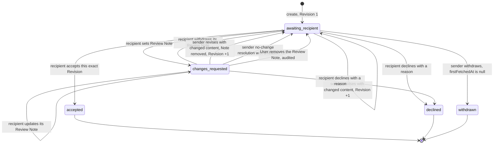
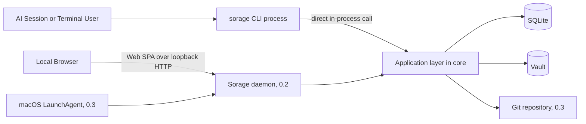
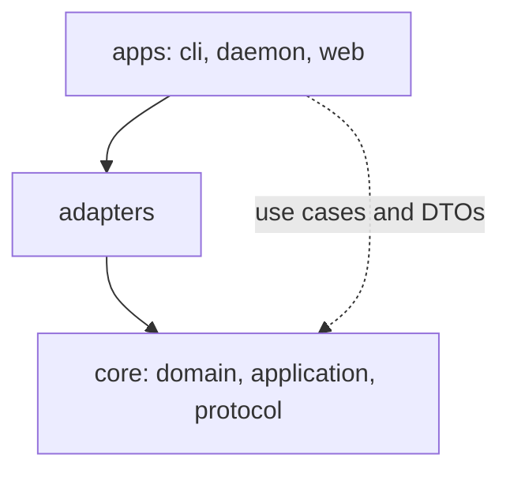

# Domain and Architecture

## 1. Canonical terms

| Term | Definition |
|---|---|
| Installation | One Sorage setup for one operating-system user and one Sorage home directory |
| Vault | Configured directory storing current managed Artifacts and Git backup snapshots |
| Project | Stable logical participant registered in Sorage |
| Project Binding | Normalized directory mapping a Project to this Installation |
| Binding Kind | Whether a Project Binding matches a git repository through its git common directory or a plain directory |
| Unbound Project | Active Project with zero Project Bindings; a derived condition, not a status value |
| Workspace | Current directory context used by a CLI actor |
| Unregistered Workspace | Workspace not matched to a Project Binding |
| Handoff | One sender-to-one-recipient document delivery and review lifecycle |
| Dispatch Group | Correlation UUID shared by Handoffs created from one multi-recipient send |
| Artifact | The one current managed file attached to a Handoff |
| Materialization | Returning a locally readable path to the current Artifact without copying in the MVP |
| Revision | Counter beginning at 1 and increasing only when Artifact content changes |
| Row Version | Counter increasing on every Handoff mutation for optimistic concurrency |
| Review Note | The one current recipient-authored or User-authored feedback item for a Handoff |
| Accepted | Terminal state recording that the recipient accepted one exact Revision |
| Declined | Terminal state recording that the recipient rejected the Handoff with a reason |
| Withdrawn | Terminal state recording that the sender cancelled a Handoff that was never fetched |
| Terminal state | Review state that accepts no further content mutation: `accepted`, `declined`, or `withdrawn` |
| Intent | Committed row describing a filesystem operation the Installation still owes, stored in `pending_fs_ops` |
| Provenance | Recorded origin of an operation, derived from working directory or an explicit override, not an authorization boundary |
| Tombstone | Minimal retained metadata after approved deletion; always terminal, because approval requires a terminal state |
| Snapshot | Git-backup representation of current metadata, not the operational database |

## 2. Actor types

```text
registered_project
unregistered_workspace
user
system
```

Actor resolution is **provenance**, not authorization. It records where an operation came from so the event ledger and the next-actor derivation stay meaningful. It does not isolate one AI session from another.

### 2.1 Registered Project actor

Resolved from the current working directory by the longest matching Project Binding.

When the working directory is inside a git working tree, resolution compares against the git common directory produced by `git rev-parse --path-format=absolute --git-common-dir`, so every worktree of a registered repository resolves to the same Project (PRJ-017).

`--as <project-slug>` overrides directory-based resolution for a registered Project. The Project MUST exist and MUST have at least one binding on this Installation; the resolved `senderKind` remains `registered_project` (PRJ-018).

### 2.2 Unregistered Workspace actor

Created when no binding matches and policy permits unregistered senders.

```text
workspaceKey = SHA-256(installationId + "\n" + normalizedWorkspacePath)
```

The raw path may be retained locally for usability. The workspace key is the stable identity, and `installationId` is preserved across restore so the key remains reproducible.

Sending as an unregistered Workspace fails with `SENDER_IDENTITY_DOWNGRADE`, unless `--allow-unregistered` is supplied, whenever the working directory sits in the neighbourhood of a binding; section 22.3 defines the two cases exactly (PRJ-019).

### 2.3 User actor

The local human administrator, operating through the Web UI or through a CLI command invoked with `--as-user`.

`--as-user` selects User-admin context explicitly and records `actorKind = user` on every resulting event (CLI-019). A User-admin command invoked without it returns `USER_CONTEXT_REQUIRED`.

> User-admin rows express workflow intent; any process that can read the API token or run the CLI as this OS user can assert User context (see `SEC-013` in [required-specification.md](required-specification.md)).

### 2.4 System actor

The daemon, backup scheduler, migration runner, intent drainer, and garbage collector.

## 3. Core entities

### 3.1 Project

```text
Project
- id: UUID
- slug: string, case-insensitive unique
- displayName: string
- description: nullable string
- status: active | archived
- createdAt: timestamp
- updatedAt: timestamp
```

An Unbound Project is an `active` Project with zero Project Bindings. It is derived from the binding count, never stored as a `status` value. An Unbound Project cannot receive new Handoffs, and both `project list` and `doctor` flag it (PRJ-022).

A slug collision under case-insensitive comparison returns `PROJECT_SLUG_CONFLICT`.

An **open Handoff** is a Handoff in `awaiting_recipient` or `changes_requested` that is not deleted. A `project unbind` that would leave a Project with open Handoffs unbound requires `--confirm`, and without it returns `CONFIRMATION_REQUIRED` (PRJ-022).

### 3.2 Project Binding

```text
ProjectBinding
- id: UUID
- projectId: UUID
- installationId: UUID
- directory: normalized real path
- bindingKind: git_repository | directory
- createdAt: timestamp
- updatedAt: timestamp
```

For `bindingKind = git_repository` the stored `directory` is the git common directory, so every worktree of that repository matches one binding. For `bindingKind = directory` the stored `directory` is the normalized real path itself.

```text
UNIQUE(installationId, directory)
```

That is the only uniqueness constraint on bindings. A Project MAY have many bindings on one Installation (PRJ-016).

A `project bind` whose directory is already bound, or whose directory lies inside an already-bound git repository, returns `BINDING_DUPLICATE`; binding an individual worktree path is that error, because worktrees already resolve through the common directory. A binding that would place the Vault inside a Project directory, or a Project directory inside the Vault, returns `VAULT_CONTAINMENT` (VLT-017).

### 3.3 Handoff

```text
Handoff
- id: UUID
- dispatchGroupId: nullable UUID
- supersedesHandoffId: nullable UUID
- title: string
- senderKind: registered_project | unregistered_workspace | user
- senderProjectId: nullable UUID
- senderWorkspaceKey: nullable string
- senderPathSnapshot: nullable string
- recipientProjectId: UUID
- currentArtifactId: nullable UUID
- revision: integer >= 1
- rowVersion: integer >= 1
- reviewState: awaiting_recipient | changes_requested | accepted | declined | withdrawn
- acceptedRevision: nullable integer
- acceptedAt: nullable timestamp
- declinedAt: nullable timestamp
- declineReason: nullable string
- withdrawnAt: nullable timestamp
- consecutiveNoChangeResolutions: integer >= 0
- firstFetchedAt: nullable timestamp
- reviewEngagedAt: nullable timestamp
- pinned: boolean
- archivedAt: nullable timestamp
- deletedAt: nullable timestamp
- createdAt: timestamp
- updatedAt: timestamp
```

`currentArtifactId` is null only for a tombstone, that is, only when `deletedAt` is set (HND-001).

`consecutiveNoChangeResolutions` counts no-change resolutions since the last content revision and resets to 0 whenever the Artifact content changes.

`reviewEngagedAt` is set by the first `review set` on the Handoff and is never cleared, not by a Note withdrawal and not by an administrative Note removal. Together with `firstFetchedAt` it records that the recipient has engaged, which is what makes `withdraw` unavailable.

`supersedesHandoffId` is validated at creation (HND-018): the target MUST exist, otherwise `HANDOFF_NOT_FOUND`, and MUST be in a terminal state, otherwise `HANDOFF_NOT_TERMINAL`. The target need not share the recipient, a tombstone may be superseded, and every Handoff of one fan-out may reference the same predecessor.

### 3.4 Artifact

```text
Artifact
- id: UUID
- handoffId: UUID
- storageKey: string, artifacts/<handoff-id>/<artifact-id>/<stored-name>
- originalName: string
- storedName: string
- mimeType: string
- sizeBytes: integer
- sha256: lowercase hexadecimal string
- importedFromPath: nullable string
- materialized: boolean
- createdAt: timestamp
```

`storageKey` is the sole authority for an Artifact's location inside the Vault; no other field, convention, or derived path may be used to find the bytes (VLT-020). The `<artifact-id>` segment gives every Revision a unique slot, so replacement never overwrites in place.

`materialized` is false between the transaction that created the Artifact row and the transaction that confirms the file reached its `storageKey` path. Reads of a Handoff whose current Artifact is not materialized return `ARTIFACT_MATERIALIZING`.

Only `currentArtifactId` is live. A superseded Artifact row is deleted in the same transaction that supersedes it, and its bytes are removed by the committed `unlink` Intent; garbage collection never touches a path named by a pending Intent.

### 3.5 Review Note

```text
ReviewNote
- handoffId: UUID, unique
- authorKind: registered_project | user
- authorProjectId: nullable UUID
- targetRevision: integer
- body: string
- createdAt: timestamp
- updatedAt: timestamp
```

`authorProjectId` is null when `authorKind = user`, so a User-authored proxy Note is representable without inventing a Project identity.

### 3.6 Deletion Request

```text
DeletionRequest
- id: UUID
- handoffId: UUID
- requestedByKind: actor type
- requestedById: nullable UUID or workspace key
- reason: nullable string
- status: pending | approved | rejected
- requestedAt: timestamp
- resolvedAt: nullable timestamp
- resolvedByUser: nullable string
- resolutionNote: nullable string
```

At most one pending Deletion Request may exist per Handoff.

### 3.7 Event

```text
Event
- id: UUID
- handoffId: nullable UUID
- eventType: string
- actorKind: actor type
- actorId: nullable string
- rowVersion: nullable integer
- metadataJson: JSON
- createdAt: timestamp
```

Events contain metadata, identifiers, hashes, and transitions. They do not contain historical Artifact bytes.

### 3.8 Pending Filesystem Operation

```text
PendingFsOp
- id: UUID
- op: activate | unlink
- fromPath: nullable string
- toPath: string
- artifactId: nullable UUID
- createdAt: timestamp
- attempts: integer
```

A row in `pending_fs_ops` is a committed Intent. Its presence means the database already believes the effect will happen, so every process is obliged to complete it before doing anything else.

### 3.9 Idempotency Key

```text
IdempotencyKey
- key: string
- scope: operation name
- requestHash: string
- responseJson: JSON
- createdAt: timestamp
- expiresAt: timestamp, createdAt plus 24 hours
```

A replay with the same `key`, `scope`, and `requestHash` returns `responseJson` unchanged. The same key with a different `requestHash` returns `IDEMPOTENCY_CONFLICT`. Replay detection happens before the Row Version check (API-012).

## 4. Review state machine

### 4.1 Diagram



There are five review states and three terminal states. `accepted`, `declined`, and `withdrawn` are terminal for content; a later change uses a new Handoff, normally with `supersedesHandoffId`.

### 4.2 Transition table

| From | Operation | Actor | Guard | To | Revision effect | Row Version effect | Events emitted |
|---|---|---|---|---|---|---|---|
| none | `send` | Sender Project, Workspace, or User | Recipient active and bound; source staged and verified; any `--supersedes` target exists and is terminal | `awaiting_recipient` | set to 1 | set to 1 | `HANDOFF_CREATED`, then `ARTIFACT_ACTIVATED` on completion |
| `awaiting_recipient` | `review set` | Recipient or User | Target Revision is current; the sender may never author a Note | `changes_requested` | unchanged | +1 | `REVIEW_NOTE_CREATED` |
| `changes_requested` | `review set` | Recipient or User | Target Revision is current | `changes_requested` | unchanged | +1 | `REVIEW_NOTE_UPDATED` |
| `changes_requested` | `review withdraw` | Recipient | A Review Note exists on the recipient's inbox Handoff, whichever actor authored it | `awaiting_recipient` | unchanged | +1 | `REVIEW_NOTE_WITHDRAWN` |
| Any non-terminal | `review remove --as-user --confirm` | User | A Review Note exists; action is audited | `awaiting_recipient` | unchanged | +1 | `REVIEW_NOTE_REMOVED` |
| `awaiting_recipient` | `revise --file` | Sender or User | New SHA-256 differs, else `NO_CONTENT_CHANGE` | `awaiting_recipient` | +1 | +1 | `HANDOFF_REVISED`, `ARTIFACT_ACTIVATED`, `ARTIFACT_UNLINKED` |
| `changes_requested` | `revise --file` | Sender or User | New SHA-256 differs; the Note is removed in the same transaction; counter resets to 0 | `awaiting_recipient` | +1 | +1 | `HANDOFF_REVISED`, `REVIEW_NOTE_RESOLVED`, `ARTIFACT_ACTIVATED`, `ARTIFACT_UNLINKED` |
| `changes_requested` | `revise --no-change --reason` | Sender or User | `consecutiveNoChangeResolutions` is 0, else `NO_CHANGE_LIMIT`; reason non-empty | `awaiting_recipient` | unchanged | +1 | `HANDOFF_NO_CHANGE_RESOLVED`, `REVIEW_NOTE_RESOLVED` |
| `awaiting_recipient` | `revise --no-change --reason` | Sender or User | Rejected with `NO_REVIEW_NOTE`; there is no Note to resolve | unchanged | unchanged | unchanged | none |
| `awaiting_recipient` | `accept --expected-revision --expected-row-version` | Recipient or User | No Review Note, else `REVIEW_NOTE_PRESENT`; the current Artifact has `materialized = 1`, else `ARTIFACT_MATERIALIZING`; both expected values match | `accepted` | unchanged | +1 | `HANDOFF_ACCEPTED` |
| `awaiting_recipient` | `decline --reason --expected-row-version` | Recipient or User | Reason non-empty; expected Row Version matches | `declined` | unchanged | +1 | `HANDOFF_DECLINED` |
| `changes_requested` | `decline --reason --expected-row-version` | Recipient or User | Reason non-empty; expected Row Version matches | `declined` | unchanged | +1 | `HANDOFF_DECLINED` |
| `awaiting_recipient` | `withdraw` | Sender or User | `firstFetchedAt` is null and `reviewEngagedAt` is null, else `HANDOFF_ALREADY_FETCHED` | `withdrawn` | unchanged | +1 | `HANDOFF_WITHDRAWN` |
| `changes_requested` | `withdraw` | Sender or User | Rejected with `REVIEW_NOTE_PRESENT` | unchanged | unchanged | unchanged | none |
| Any except a tombstone | `get`, `inbox`, `outbox` | Sender, Recipient, or User | Participant only; a non-participant read returns `HANDOFF_NOT_FOUND` | unchanged | unchanged | unchanged | none; `firstFetchedAt` is never set by a read of metadata |
| Any except a tombstone | `fetch`, `GET /api/v1/handoffs/{id}/artifact/content` | Sender, Recipient, or User | Participant only; the current Artifact has `materialized = 1`, else `ARTIFACT_MATERIALIZING` | unchanged | unchanged | unchanged | `ARTIFACT_FETCHED_FIRST_TIME` on the first fetch by the Recipient or the User only, which also sets `firstFetchedAt`; a Sender fetch of its own Handoff sets nothing and emits nothing |
| Any, terminal included | `pin`, `unpin` | User | `--as-user` | unchanged | unchanged | +1 | `HANDOFF_PINNED`, `HANDOFF_UNPINNED` |
| Terminal only | `archive` | User | `--as-user`; a non-terminal Handoff returns `HANDOFF_ARCHIVE_INVALID` | unchanged | unchanged | +1 | `HANDOFF_ARCHIVED` |
| Terminal and archived | `unarchive` | User | `--as-user`; `archivedAt` is set, else `HANDOFF_NOT_ARCHIVED` | unchanged | unchanged | +1 | `HANDOFF_UNARCHIVED` |
| Any except a tombstone | `delete request` | Sender, Recipient, or User | No request is already pending, else `DELETION_ALREADY_REQUESTED` | unchanged | unchanged | +1 | `DELETION_REQUESTED` |
| Terminal, request pending | `delete approve --as-user --confirm` | User | Review state is terminal, else `HANDOFF_NOT_TERMINAL`; `--confirm-pinned <id>` additionally required when pinned, else `PINNED_DELETE_CONFIRMATION` | unchanged; `deletedAt` set, tombstone | unchanged | +1 | `DELETION_APPROVED`, then `ARTIFACT_UNLINKED` |
| Request pending | `delete reject --as-user` | User | A request is pending | unchanged | unchanged | +1 | `DELETION_REJECTED` |
| Terminal | `revise`, `review set`, `review withdraw`, `review remove`, `accept`, `decline`, `withdraw` | Any | Rejected with `HANDOFF_TERMINAL` | unchanged | unchanged | unchanged | none |
| Tombstone | `fetch`, `revise`, `review set`, `review withdraw`, `review remove`, `accept`, `decline`, `withdraw`, `delete request` | Any | Rejected with `HANDOFF_DELETED` | unchanged | unchanged | unchanged | none |
| Tombstone | `get`, `inbox`, `outbox`, `pin`, `unpin`, `archive`, `unarchive` | Sender, Recipient, or User for the reads; User for the rest | Allowed; every tombstone is terminal, so `archive` is always valid | unchanged | unchanged | unchanged for the reads, +1 for `pin`, `unpin`, `archive`, `unarchive` | `HANDOFF_PINNED`, `HANDOFF_UNPINNED`, `HANDOFF_ARCHIVED`, `HANDOFF_UNARCHIVED` |

The table has 25 rows. Every review-state transition of the state machine appears in it, and every remaining state and operation pair, including every operation on a tombstone, appears as an explicit rejection row naming its error code. Any pair that is not listed is undefined and MUST be rejected.

## 5. Orthogonal lifecycle fields

| Field | Owner | Meaning |
|---|---|---|
| `pinned` | Handoff | User marks the Handoff for long-term retention, independent of review state |
| `archivedAt` | Handoff | Terminal Handoff is hidden from the default operational list; reversible with `unarchive` |
| `deletedAt` | Handoff | Tombstone marker; content was deleted and only minimal metadata remains |
| Pending Deletion Request | DeletionRequest | Pending User decision, independent of review state |
| `firstFetchedAt` | Handoff | Timestamp of the first `fetch` or artifact-content read by the recipient Project or the User; a sender read never sets it, so null means the recipient has never pulled the bytes |
| `reviewEngagedAt` | Handoff | Timestamp of the first `review set`; never cleared, so a withdrawn Note still counts as engagement |
| `materialized` | Artifact | Whether the file has reached its `storageKey` path; false makes reads return `ARTIFACT_MATERIALIZING` |

These fields are not folded into one large state enum. `firstFetchedAt` and `reviewEngagedAt` are exposed in public Handoff representations (HND-024) because together they are the guard for `withdraw`, and neither increments Row Version when it is set.

Operations that remain allowed in a terminal state, each incrementing Row Version: `pin`, `unpin`, `archive`, `unarchive`, `delete request`, `delete approve`, `delete reject` (LIFE-017).

Operations rejected in a terminal state with `HANDOFF_TERMINAL`: `revise`, `review set`, `review withdraw`, `review remove`, `accept`, `decline`, `withdraw`.

Immutability in a terminal state covers Artifact content, Revision, and Review Note. It does not freeze retention fields, and it does not block approved deletion (LIFE-005).

Deletion approval requires a terminal review state, so **every tombstone is terminal** (LIFE-018). A tombstone is therefore a strictly narrower condition than a terminal state, and it carries its own rejection list.

Operations rejected on a tombstone with `HANDOFF_DELETED`: `fetch`, `revise`, `review set`, `review withdraw`, `review remove`, `accept`, `decline`, `withdraw`, `delete request`.

Operations that remain allowed on a tombstone: `get`, listing through `inbox` and `outbox`, `pin`, `unpin`, `archive`, and `unarchive`. Listings include tombstones only with `--include-deleted`.

## 6. Next actor derivation

| Condition | Next actor |
|---|---|
| `awaiting_recipient` | Recipient Project |
| `changes_requested` | Sender identity |
| `accepted` | None |
| `declined` | None |
| `withdrawn` | None |
| `deletedAt` set, tombstone | None |
| Pending deletion request | User, in addition to the review next actor |
| Integrity or configuration failure | User |

The protocol SHOULD expose `reviewNextActor` and `administrativeNextActor` separately.

## 7. Permission matrix

| Operation | Sender | Recipient | User |
|---|---:|---:|---:|
| Create Handoff | Yes | Yes, when acting as sender | Yes |
| Read Handoff | Own outbox | Own inbox | Yes |
| Materialize current Artifact | Own outbox | Own inbox | Yes |
| Create or update Review Note | No | Yes | Yes |
| Withdraw own Review Note | No | Yes | No; the User removes a Note only through the audited administrative removal (REV-016) |
| Remove Review Note administratively | No | No | Yes, `--as-user`, audited |
| Revise Artifact | Yes | No | Yes |
| No-change resolution | Yes | No | Yes |
| Accept | No | Yes | Yes |
| Decline | No | Yes | Yes |
| Withdraw Handoff | Yes | No | Yes |
| Pin or unpin | No | No | Yes, `--as-user` |
| Archive | No | No | Yes, `--as-user` |
| Unarchive | No | No | Yes, `--as-user` |
| Request deletion | Yes | Yes | Yes |
| Approve or reject deletion | No | No | Yes, `--as-user` |
| Reopen a terminal Handoff | No | No | Not supported |

> User-admin rows express workflow intent; any process that can read the API token or run the CLI as this OS user can assert User context (see `SEC-013` in [required-specification.md](required-specification.md)).

The User may act as an administrative proxy, but the event MUST record `user`, not the Project.

### 7.1 Administrative operations

Installation-scoped operations are not Handoff mutations, so the Sender and Recipient columns do not apply; the table states whether User-admin context (`--as-user`, CLI-019) is required. The resolved provenance actor, or `user`, is recorded in the event ledger either way.

| Operation | Context required | Notes |
|---|---|---|
| Configuration write, `config set` and `config edit` | User, `--as-user` | Serialized by `config.lock`; the daemon is the authority while running (CFG-019) |
| Configuration read, `config show` and `config validate` | Any actor | Read-only |
| Vault status and verify, `vault status` and `vault verify` | Any actor | Read-only checks |
| Vault move, `vault move` | User, `--as-user` | Serialized by `vault-move.lock`; other processes receive `SERVICE_PAUSED` (RUN-014) |
| Backup run, status, and verify | Any actor | `backup run` is serialized by `backup.lock`; a concurrent run returns `BACKUP_IN_PROGRESS` |
| Backup enable, disable, enable-push, and disable-push | User, `--as-user` | Writes configuration, so it follows the configuration write rules |
| Backup restore, `backup restore --as-user --confirm` | User, `--as-user` | Bootstrap-only against an empty database (`RESTORE_TARGET_NOT_EMPTY` otherwise); the daemon must be idle; `--dry-run` needs no `--confirm` |
| Daemon lifecycle, `daemon start`, `stop`, `restart`, `status`, and `web` | Any actor | Process control only; no Handoff is mutated |
| Token rotation, `token rotate` | User, `--as-user` | Invalidates browser sessions (SEC-020) |
| Uninstall, `uninstall` | User, `--as-user --confirm` | Never deletes the Vault (INIT-016) |
| Project add, bind, unbind, rename, list, show, and resolve | Any actor | Unbinding a Project that leaves open Handoffs requires `--confirm` (PRJ-022) |
| Project archive and unarchive | User, `--as-user` | PRJ-021 keeps an archived Project's existing inbox operable |

A User-admin operation invoked without `--as-user` returns `USER_CONTEXT_REQUIRED` (CLI-019). The honesty clause above applies to this block unchanged: `--as-user` expresses workflow intent, not an operating-system boundary.

## 8. Multi-recipient fan-out

Input:

```text
sender: Project A
recipients: Project B, Project C, Project D
source: contract.md
```

Output:

```text
Dispatch Group G
- Handoff HB -> Project B
- Handoff HC -> Project C
- Handoff HD -> Project D
```

Invariants:

- Each Handoff has a unique UUID.
- Each Handoff has its own Artifact copy with its own `storageKey`.
- Initial hashes may match.
- Revisions diverge independently.
- Review Notes diverge independently.
- Acceptance, decline, withdrawal, pinning, archiving, and deletion diverge independently.
- Creation is all-or-nothing.
- Dispatch Group is correlation metadata only.

All-or-nothing creation is a pure database property under the intent log. Every Handoff row, every Artifact row, and every `activate` Intent for the fan-out commit in one transaction, and no filesystem rename participates in that decision. A crash between two renames therefore cannot create a partial Dispatch Group; it can only leave some Artifacts unmaterialized until the next drain.

## 9. Revision semantics

- Revision starts at 1.
- Revision increases only when the current Artifact SHA-256 changes.
- Review Note creation, update, withdrawal, and administrative removal do not increase Revision.
- A no-change resolution does not increase Revision; it only clears the Note and returns the Handoff to `awaiting_recipient`.
- Pin, unpin, archive, unarchive, deletion request, fetch, and configuration do not increase Revision.
- `consecutiveNoChangeResolutions` resets to 0 on every content revision.
- Row Version increases exactly once for every successful Handoff mutation, including Note withdrawal, administrative Note removal, no-change resolution, pin, unpin, archive, unarchive, and deletion decisions.
- Reads, `fetch`, the Web artifact-content endpoint, and the events they emit never increment Row Version (HND-025). Recording `firstFetchedAt` is part of that read path and is likewise not a Row Version bump.
- Only `fetch` and the Web artifact-content endpoint set `firstFetchedAt` and emit `ARTIFACT_FETCHED_FIRST_TIME`, only on the first such read, and only when the actor is the recipient Project or the User; the sender reading its own Handoff sets nothing, because the field exists to record recipient engagement (HND-012). There is no later sampling. `get`, the Web detail screen, and listings are metadata reads that set nothing and emit nothing (HND-012).
- `--expected-row-version` is the value the client currently holds, not the value it expects afterwards (HND-025). A client that sent a Handoff and observed Row Version 1 passes `1` to its next mutation.
- `--expected-row-version` is optional everywhere except `accept` and `decline`, and it is enforced whenever it is supplied (HND-014).
- A stale Row Version produces `ROW_VERSION_CONFLICT`; a stale target Revision produces `REVISION_CONFLICT`.
- Same-content revise produces `NO_CONTENT_CHANGE` unless the sender explicitly uses `revise --no-change --reason`, which is valid only in `changes_requested` and returns `NO_REVIEW_NOTE` anywhere else.
- Sorage never continues a Revision series across Handoffs. Work that continues after a terminal state starts a new Handoff carrying `--supersedes <id>`, whose target MUST exist (`HANDOFF_NOT_FOUND`) and MUST be terminal (`HANDOFF_NOT_TERMINAL`); the target may be a tombstone, need not share the recipient, and may be referenced by every Handoff of one fan-out (HND-018).

## 10. Review Note semantics

- Maximum cardinality is one per Handoff.
- It belongs to one exact target Revision, and creation or update against a stale target Revision fails.
- `authorKind` records whether the recipient Project or the User wrote it; `authorProjectId` is null for a User-authored Note.
- The sender MUST NOT author a Review Note on its own Handoff.
- The recipient may update the body while the state remains `changes_requested`.
- The recipient may withdraw the current Note whichever actor authored it, which returns the Handoff to `awaiting_recipient` with the Revision unchanged and emits `REVIEW_NOTE_WITHDRAWN` (REV-016); the User removes a Note only through `review remove --as-user` (REV-015).
- The sender cannot clear a Note directly. The sender resolves it either by revising with changed content, which removes the Note in the same transaction, or by one bounded no-change resolution.
- Whenever a sender operation removes a Note, `REVIEW_NOTE_RESOLVED` is appended in the same transaction as `HANDOFF_REVISED` or `HANDOFF_NO_CHANGE_RESOLVED`. The three removal events are distinct by actor: `REVIEW_NOTE_RESOLVED` is the sender, `REVIEW_NOTE_WITHDRAWN` is the recipient, and `REVIEW_NOTE_REMOVED` is the User.
- A no-change resolution requires a reason, removes the Note, keeps the Revision, and emits `HANDOFF_NO_CHANGE_RESOLVED` (REV-017). It is valid only in `changes_requested`; elsewhere it returns `NO_REVIEW_NOTE`.
- No-change resolution is bounded: it is allowed only while `consecutiveNoChangeResolutions` is 0, so two consecutive no-change resolutions are impossible and the second attempt returns `NO_CHANGE_LIMIT`. The next resolution after one no-change resolution MUST change content.
- The User may remove any Review Note through `review remove --as-user --confirm`; the removal is audited as `REVIEW_NOTE_REMOVED` and returns the Handoff to `awaiting_recipient` (REV-015).
- Sorage does not provide native historical Review Note versions.

## 11. Accept semantics

Accept means:

> The recipient accepts this exact Revision of the Handoff.

Accept explicitly does **not** mean that any downstream action was completed. Sorage records agreement about a document, not the execution of the work the document describes.

Accept also does not mean:

- The file was opened.
- The file was downloaded.
- The Handoff is archived.
- The Handoff is pinned.
- The Handoff is deleted.

Accept records the exact Revision in `acceptedRevision` and the moment in `acceptedAt`. It fails with `REVIEW_NOTE_PRESENT` while a Review Note exists, fails with `ARTIFACT_MATERIALIZING` while the current Artifact has `materialized = 0`, and requires both `--expected-revision` and `--expected-row-version`.

The two other terminal outcomes are recorded the same way. Decline records `declinedAt` and a mandatory `declineReason`. Withdraw records `withdrawnAt` and is available only while the recipient has neither fetched nor reviewed, that is while `firstFetchedAt` and `reviewEngagedAt` are both null; a fetched Handoff returns `HANDOFF_ALREADY_FETCHED` and a Handoff carrying a Note returns `REVIEW_NOTE_PRESENT`. All three are immutable in content, and all three keep retention operations and approved deletion available.

## 12. Deletion semantics

Deletion is two-phase:

1. Project, Workspace, or User creates a Deletion Request. This is allowed in any state that is not already a tombstone; a second request while one is pending returns `DELETION_ALREADY_REQUESTED`.
2. User approves or rejects it with `--as-user`. Approval requires a terminal review state, otherwise `HANDOFF_NOT_TERMINAL`; a pinned Handoff additionally requires `--confirm-pinned <id>`, otherwise `PINNED_DELETE_CONFIRMATION` (LIFE-012, LIFE-018).

Because approval is possible only from a terminal state, every tombstone is terminal, and an in-flight Handoff must first be accepted, declined, or withdrawn before its bytes can be removed.

Approval first verifies that the current Artifact exists and matches its recorded SHA-256, failing with `ARTIFACT_CORRUPTED` otherwise; one transaction then sets `deletedAt`, detaches `currentArtifactId` to null, deletes the current Review Note and Artifact row, inserts an `unlink` Intent for the Artifact path, and appends `DELETION_APPROVED` (VLT-023).

After that commit:

- The committed `unlink` Intent is executed and then cleared, emitting `ARTIFACT_UNLINKED`.
- An Intent that cannot yet be executed stays pending and is visible as cleanup pending; garbage collection never touches a path named by a pending Intent.
- A minimal Handoff tombstone remains, with `currentArtifactId` null.
- The tombstone rejects `fetch`, `revise`, `review set`, `review withdraw`, `review remove`, `accept`, `decline`, `withdraw`, and `delete request` with `HANDOFF_DELETED`, while `get`, listing, `pin`, `unpin`, `archive`, and `unarchive` stay available (LIFE-018).
- The event ledger records the approval.
- Git history is not rewritten, and deletion never claims to purge earlier commits (LIFE-015).

## 13. Architectural style

Sorage is a ports-and-adapters application whose rules live in one place and are entered by more than one process.



The CLI does not call the daemon for domain operations. It links the application layer and executes the use case in its own process, so milestone 0.1 works with no daemon installed (RUN-003). The daemon reaches the same use cases through the same application layer and adds no domain rules of its own.

RUN-001 replaces the earlier single-writer rule with explicit serialization. Correctness under several concurrent writer processes comes from three mechanisms, none of which depends on how many processes exist:

- One SQLite write transaction at a time per database, using WAL mode and an explicit `busy_timeout`, so writes queue rather than interleave.
- Row Version compare-and-set on every Handoff mutation, so a writer that acted on stale state fails loudly with `ROW_VERSION_CONFLICT` instead of overwriting.
- The committed filesystem intent log, so every filesystem effect is replayable by whichever process runs next.

Operations that cannot be expressed as one database transaction, such as a configuration write, a Vault move, or a backup run, are additionally serialized by `O_EXCL` lockfiles under `~/.sorage/run/` (see section 19).

## 14. Process responsibilities

### 14.1 CLI

- Parse commands and flags, and render human or JSON output.
- Resolve actor provenance from the working directory, `--as`, or `--as-user`.
- Drain `pending_fs_ops` at process start, before executing the requested command (RUN-002).
- Call application use cases directly, in-process, through the same ports the daemon uses.
- Never issue raw SQL and never write managed Vault paths outside the application layer (CLI-018).
- Contact the daemon only for `web` and `daemon` commands, where `DAEMON_UNAVAILABLE` is meaningful.
- Read `~/.sorage/run/daemon.json` to discover a running daemon.

### 14.2 Daemon, milestone 0.2 and 0.3

- Serve the Web SPA and `/api/v1` on a loopback interface only.
- Validate the Host header against the allowlist before routing (SEC-017), and set `Content-Security-Policy`, `X-Content-Type-Options`, and `Referrer-Policy` on every response (SEC-018).
- Authenticate every request with `Authorization: Bearer`, exchange the one-time browser secret for a session token, and use no cookies (SEC-019).
- Own the API token file and implement `token rotate` (SEC-020).
- Act as the only Sorage writer of `config.yaml` while running, so every CLI configuration write goes through `PUT /api/v1/config` (CFG-019).
- Run the backup scheduler on a 60-second tick and the garbage collector; it is the only process that runs scheduled jobs (RUN-002).
- Run the periodic Artifact checksum sweep, bounded to 64 MiB of reads per garbage-collection tick. No process performs a checksum sweep at start-up; exhaustive verification belongs to `doctor` and `vault verify`.
- Drain `pending_fs_ops` at start, exactly like the CLI.
- Publish `~/.sorage/run/daemon.json` and hold `daemon.lock` for its lifetime.
- Execute the same application use cases as the CLI; hold no additional domain rules.

### 14.3 Web SPA

- Present dashboard, Handoff lists, detail, Projects, backup, and settings screens.
- Upload files through streaming multipart.
- Render safe previews.
- Invoke User-admin actions.
- Show configuration as a read-only YAML view (WEB-014).
- Never bypass the local API.

## 15. Repository layout

Sorage is a standalone repository. It builds, tests, and packages from its own root (NFR-013).

```text
sorage/
├── README.md
├── AGENTS.md
├── Makefile
├── package.json
├── bun.lock
├── .bun-version
├── docs/
├── skills/
│   └── use-sorage/
│       └── SKILL.md
├── packages/
│   ├── core/                     # domain, application use cases, protocol DTOs
│   └── adapters/                 # SQLite, filesystem, git, macOS, HTTP, testkit
├── apps/
│   ├── cli/
│   ├── daemon/
│   └── web/
├── migrations/
└── scripts/
```

Dependency direction:



Rules:

- `core` is the domain model plus the application use cases plus the versioned protocol DTOs, in one package.
- `core` MUST NOT import `adapters`, MUST NOT import `apps`, and MUST NOT import any ecosystem tool; the boundary is lint-enforced and runs inside `make test-prepare` (NFR-014).
- `adapters` implements the ports declared in `core` and depends on `core` only.
- `apps/*` import `core` application use cases and protocol DTOs and compose adapters at their entry point; they never import domain internals.
- Database rows never leave `adapters`; public responses use protocol DTOs.
- The Web application imports protocol types, not database types.

### 15.1 Ecosystem boundary

- Aquarium, Podway, Mulgae, Gaori, and Sanho are development tooling for this repository. None of them is a source dependency of any Sorage package, at build time or at run time (GEN-009, GEN-010).
- Their use is declared in `AGENTS.md` at the repository root, which is the only place the development workflow binds to them.
- Discovery for recipient sessions ships as `skills/use-sorage/SKILL.md` inside this repository. Sorage adds no handler and requires no change to Aquarium (GEN-011).
- Interoperability with a sibling tool happens by invoking the public `sorage` CLI or the local API, never by importing Sorage packages.
- Runtime identity is independent of the tooling: `sorage`, `~/.sorage/`, `SORAGE_HOME`, and `xyz.rootkernel.sorage`.

## 16. Core application ports

```typescript
interface ProjectRepository {}
interface HandoffRepository {}
interface EventRepository {}
interface ArtifactStore {}
interface IntentLog {}
interface IdempotencyStore {}
interface ConfigStore {}
interface BackupService {}
interface GitClient {}
interface Lock {}
interface Clock {}
interface IdGenerator {}
interface ActorResolver {}
interface PlatformService {}
interface UnitOfWork {}
```

`GitClient` and `BackupService` arrive with milestone 0.3; `PlatformService` is defined in section 23. Interfaces are designed around application behavior, not adapter convenience.

`UnitOfWork.run` is synchronous, because every candidate SQLite driver is synchronous and an awaited callback would let two logical transactions interleave on one connection:

```typescript
interface UnitOfWork {
  run<T>(fn: (tx: Tx) => T): T;
}
```

Two rules follow, and both are lint-enforced: no `await` may appear inside the callback, and filesystem I/O never happens inside a transaction. Staging and verification run before the transaction; renames and unlinks run after it.

## 17. Operational storage

Sorage home:

```text
~/.sorage/
├── config.yaml
├── config.yaml.bak               # last valid copy, replaced only after full validation
├── vault/                        # default Vault, configurable
├── state/
│   ├── sorage.sqlite3            # plus -wal and -shm
│   ├── api-token                 # 0.2, mode 0600, at least 32 random bytes, base64url
│   └── backups/                  # database snapshots taken with VACUUM INTO
├── logs/
│   └── sorage.log                # plus rotated files
└── run/
    ├── daemon.json               # {pid, host, port, startedAt, version, installationId}
    ├── daemon.lock
    ├── config.lock
    ├── backup.lock
    ├── migration.lock
    └── vault-move.lock
```

Vault:

```text
<Vault>/
├── .sorage-vault.json            # {type, schemaVersion, installationId, createdAt}
├── .gitattributes                # artifacts/** -text -diff ; snapshots/** text eol=lf ; .sorage-vault.json text eol=lf
├── .gitignore                    # staging/
├── artifacts/
│   └── <handoff-id>/
│       └── <artifact-id>/
│           └── <stored-name>
├── snapshots/
│   ├── projects.json
│   ├── handoffs/
│   │   └── <first-2-hex-of-id>/
│   │       └── <handoff-id>.json
│   ├── events.jsonl
│   └── manifest.json
└── staging/
```

`.gitattributes` is written at Vault initialization and checked by `backup verify`. Without it a clone with `core.autocrlf=true` rewrites text Artifact bytes and breaks their recorded SHA-256 (BKP-022).

`snapshots/handoffs/` is sharded by the first two hexadecimal characters of the Handoff UUID so a ten-thousand-Handoff Vault never puts ten thousand files in one directory.

`snapshots/events.jsonl` carries the exported event ledger, so the audit trail survives a restore (BKP-023).

`staging/` is ignored by Git and is swept only after the intent drain has finished.

## 18. Database

SQLite requirements:

- Explicit, immutable migrations tracked in `schema_migrations`
- Foreign keys enabled on every connection
- WAL mode
- Explicit `busy_timeout`
- One write connection per process
- Prepared statements
- One transaction for every mutation, with its events appended inside the same transaction
- UTC timestamps

Tables:

```text
schema_migrations
projects
project_bindings
handoffs
artifacts
review_notes
deletion_requests
events
pending_fs_ops
idempotency_keys
backup_runs
```

`backup_runs` is the only scheduler authority; there is no separate scheduler state file.

Indexes:

- `handoffs(recipientProjectId, reviewState, updatedAt)` for inbox listing
- `handoffs(senderProjectId, reviewState, updatedAt)` for outbox listing by Project
- `handoffs(senderWorkspaceKey)` for outbox listing by Workspace
- `handoffs(dispatchGroupId)` for fan-out correlation
- `pending_fs_ops(createdAt)` for drain ordering
- `idempotency_keys(expiresAt)` for expiry sweeps
- `events(handoffId, createdAt)` for the detail timeline
- `artifacts(handoffId)` for orphan detection and garbage collection

Uniqueness constraints:

- `projects.slug`, compared case-insensitively
- `project_bindings(installationId, directory)`
- `review_notes.handoffId`
- `idempotency_keys(key, scope)`

## 19. Mutation coordination

Every mutation follows the same shape:

1. Resolve actor provenance and check the permission matrix.
2. Replay the idempotency key when one was supplied, before anything else.
3. Load the current Handoff and compare the expected Row Version or ETag when supplied.
4. Stage and verify filesystem inputs, outside any transaction.
5. Run one synchronous write transaction containing the domain mutation, the Row Version compare-and-set, the Intent rows, and the event rows.
6. Execute the committed Intents after the commit returns.
7. Run one short transaction that records completion and deletes the executed Intents.
8. Leave anything still unfinished to the idempotent drain and to garbage collection.

Row Version compare-and-set is a single statement, and the driver's affected-row count is the verdict:

```sql
UPDATE handoffs SET rowVersion = rowVersion + 1 WHERE id = ? AND rowVersion = ?;
```

The application checks `changes === 1`. Any other value means another writer moved the row first, and the operation fails with `ROW_VERSION_CONFLICT` without retrying. Domain column assignments join the same statement, so the check and the write cannot separate.

Operations that span more than one transaction, or that touch files outside the intent log, take an exclusive lockfile under `~/.sorage/run/` created with `O_EXCL`:

| Lockfile | Protects |
|---|---|
| `config.lock` | Configuration writes |
| `vault-move.lock` | Vault relocation and, once restore exists, backup restore |
| `backup.lock` | Backup runs, scheduled or manual |
| `daemon.lock` | Single daemon instance |
| `migration.lock` | Schema migration at process start |

Each lockfile contains `{pid, startedAt, hostname}`. A lock is stale when its `pid` is not alive; `config.lock` is additionally stale when older than 30 seconds, while `daemon.lock`, `backup.lock`, `vault-move.lock`, and `migration.lock` have no age limit because their operations may legitimately run long. A stale lock may be broken by the next process; a live lock produces a conflict rather than a wait loop.

Schema migration runs at process start under `migration.lock`, which is stale only when the recorded pid is dead; the runner holds one SQLite write transaction per step and records the applied version in `schema_migrations`, so a process that waited on the lock re-checks `schema_migrations` after acquiring it and finds the version already applied (NFR-009).

## 20. Filesystem and database atomicity

### 20.1 Why an intent log

SQLite and the filesystem do not share a transaction, so one of the two effects always lands first. Renaming before the commit lets another connection's garbage collector delete a file whose row is not yet visible. Renaming after the commit without a record leaves an unrepairable gap when the process dies in between.

Sorage closes both gaps by committing the *intention* first. A row in `pending_fs_ops` is a promise that the database has already made, and every process is obliged to keep it (VLT-021).

### 20.2 Durability order

Every artifact write uses the same order, with no step reordered or skipped (VLT-022):

```text
write -> fsync(file) -> rename -> fsync(parent directory) -> commit that marks it materialized
```

### 20.3 Create and fan-out

1. Stage all N files under `<Vault>/staging/<uuid>`.
2. Verify size and SHA-256, and `fsync` each staged file.
3. One transaction: insert the Handoff rows, insert the Artifact rows with `materialized = 0`, insert N `activate` Intents, append `HANDOFF_CREATED`; commit.
4. Rename each staged file to its `storageKey` path and `fsync` the parent directory.
5. One transaction: set `materialized = 1`, delete the executed Intents, append `ARTIFACT_ACTIVATED`; commit.

### 20.4 Revise

1. Stage and verify the new file.
2. One transaction: insert a new Artifact row with a new `artifact-id` and a new `storageKey`, switch `currentArtifactId`, increment Revision, run the Row Version compare-and-set, delete the Review Note when one is present, delete the previous Artifact row, insert one `activate` Intent for the new path and one `unlink` Intent for the old path, append `HANDOFF_REVISED` and, when a Note was removed, `REVIEW_NOTE_RESOLVED`; commit.
3. Execute both Intents, then clear them and append `ARTIFACT_ACTIVATED` and `ARTIFACT_UNLINKED`.

Because the new Artifact has its own `artifact-id` segment, the old file is never overwritten in place, and a crash cannot destroy the previous Revision before the new one is durable (VLT-012).

### 20.5 Delete approval

The review state is already terminal at this point, so no Review Note can have been added since the last check, and the transaction has nothing to race against but itself.

1. Before the transaction, verify that the current Artifact exists and that its recomputed SHA-256 matches; otherwise fail with `ARTIFACT_CORRUPTED` without claiming deletion (VLT-023).
2. One transaction: set `deletedAt`, set `currentArtifactId` to null, delete any Review Note left from before the terminal transition, delete the current Artifact row, insert one `unlink` Intent, append `DELETION_APPROVED`; commit.
3. Execute the Intent, then clear it and append `ARTIFACT_UNLINKED`.

### 20.6 Recovery and garbage collection

At every process start, CLI or daemon, drain `pending_fs_ops` in `createdAt` order and idempotently:

- `activate`, destination present and source gone: the effect already happened; mark it done.
- `activate`, source still present: rename again, `fsync` the parent directory, mark it done.
- `activate`, source gone and destination missing: mark the Handoff integrity-failed and append `ARTIFACT_INTEGRITY_FAILED`. Never fabricate a replacement file.
- `unlink`, target present: remove it, `fsync` the parent directory, mark it done.
- `unlink`, target already gone: mark it done.

Only after the drain has finished may garbage collection run:

- Sweep `staging/` by age.
- Sweep files under `artifacts/` that no row in the `artifacts` table references and that are older than the 24-hour grace window.
- Never delete a path that matches any `storageKey` or any pending Intent, whatever its age.

An integrity-failed Handoff behaves like a Missing Artifact: revise, accept, backup success, and deletion claims that depend on the bytes are blocked, while diagnostics and restore remain available (VLT-023).

### 20.7 Visibility while unmaterialized

A read of a Handoff whose current Artifact has `materialized = 0` returns `ARTIFACT_MATERIALIZING`. The row is real and the operation is not lost; the caller retries after the drain. Metadata-only listings may still show the Handoff, flagged accordingly.

### 20.8 Crash points

| # | Crash point | Expected recovery outcome |
|---|---|---|
| 1 | After staging, before the intent commit | No Handoff, Artifact, or Intent row exists. The staged file is unreferenced and the `staging/` sweep removes it after its age threshold. The caller saw a failure and may retry, reusing the same idempotency key. |
| 2 | After the intent commit, before the rename | Rows exist with `materialized = 0`. Reads return `ARTIFACT_MATERIALIZING`. The next drain finds the source present, renames it, and marks the Artifact materialized. |
| 3 | After the rename, before `fsync` of the parent directory | The rename may or may not have survived. The drain re-reads the filesystem: destination present means complete; source still present means rename again; both missing means integrity failure. |
| 4 | After `fsync`, before the completion commit | Files are in their final place and Intents are still pending. The drain observes destination present and source gone, sets `materialized = 1`, and deletes the Intents. |
| 5 | During fan-out, between two renames | All rows committed together, so the Dispatch Group is complete in the database. Materialized Artifacts are readable, unmaterialized ones return `ARTIFACT_MATERIALIZING`, and the drain finishes the remainder. Fan-out atomicity is unaffected. |
| 6 | After the delete commit, before the unlink | The tombstone is authoritative and `currentArtifactId` is already null. The file is protected by the pending `unlink` Intent, and the drain removes it before clearing that Intent. |
| 7 | Process restart in the middle of a drain | Each Intent is re-evaluated from filesystem state, so a partially applied drain is safe to repeat. `attempts` increments per try, ordering stays `createdAt`, and no Intent is ever executed destructively twice. |

## 21. Configuration atomicity

1. Acquire `~/.sorage/run/config.lock` with `O_EXCL`; a lock whose `pid` is dead or whose `startedAt` is older than 30 seconds is stale and may be broken.
2. Read the current configuration and compute its ETag as a hash of the file content, not from `configRevision`, because a manual edit does not bump the counter (CFG-019).
3. Compare the supplied `If-Match` or expected ETag; a mismatch returns `CONFIG_CONFLICT`.
4. Validate the complete proposed configuration against the schema, with declared defaults applied (CFG-020).
5. Write a temporary file in the same directory, preserving existing YAML comments (CFG-018).
6. Flush and `fsync` the temporary file.
7. Replace the single `.bak` copy only after the new configuration passed full validation, so a rejected write can never destroy the last known good copy.
8. Rename the temporary file onto `config.yaml`, then `fsync` the parent directory.
9. Restore owner-only permissions.
10. Release the lock.
11. Reload permitted fields and mark the fields that require a daemon restart.

While the daemon is running it is the only Sorage writer of `config.yaml` (CFG-019), and the CLI routes every write through `PUT /api/v1/config` with `If-Match`. The CLI writes the file directly only when no daemon is running, and always under the lock.

An invalid change leaves the previous valid configuration active, and a newer invalid file is never chosen automatically over a valid canonical one.

## 22. Actor resolution

The CLI supplies the current working directory as actor context. Resolution is a pure function of the normalized path and the binding set, so `sorage project resolve --path <path>` reproduces exactly what any command would have used.

### 22.1 Workspace root of a binding

Every binding has a workspace root, which is the directory the binding claims on disk:

- For `bindingKind = directory`, the workspace root is the stored `directory` itself.
- For `bindingKind = git_repository`, the stored `directory` is the git common directory and the workspace root is the main working tree, that is the parent of the common directory. Linked worktrees lie outside that root and are matched through the common directory instead, which is why they never need their own binding.
- A binding must name a working tree, so a bare Git repository cannot be bound (ADR-0020): its common directory is itself and has no parent working tree, and `project add` and `project bind` refuse it with a configuration error rather than leaving the workspace root undefined.

### 22.2 Resolution order

1. Normalize the candidate path: expand `~`, make it absolute, and resolve symlinks.
2. When the path is inside a git working tree, resolve `git rev-parse --path-format=absolute --git-common-dir` and normalize the result, so every worktree of one repository yields the same directory.
3. Match against Project Bindings. A `git_repository` binding matches when its stored common directory equals the resolved common directory. A `directory` binding matches when its stored directory is the path itself or one of its ancestors.
4. Select the longest matching prefix; nested bindings are allowed and the deepest match wins (PRJ-007, PRJ-008).
5. When a `git_repository` binding and a `directory` binding both match, the `git_repository` binding wins, whatever the depths are. A checkout is identified by its repository, not by whichever enclosing folder happens to be bound.
6. When two bindings of the same kind match at the same depth, which is reachable only through a bind mount or an APFS firmlink, which `realpath` does not collapse, compare the stored directories physically (`dev`/`ino`): one physical directory under two Projects fails with `AMBIGUOUS_PROJECT` naming both Projects, one physical directory under one Project resolves to it, and a probe the platform cannot answer stays ambiguous rather than guessing; `--as <project-slug>` is the documented escape. `doctor` reports the same condition ahead of time as `bindings.ambiguous`. The tie itself is unreachable through the command surface - the registry's unique `(installation, directory)` constraint forbids identical stored spellings, and two distinct spellings cannot both prefix-match one canonical query path - so the comparison is defense in depth for restored or directly edited data, proven at the use-case layer.
7. Return the registered Project actor when a binding matched.
8. `--as <project-slug>` overrides steps 3 to 7 when it is supplied; a multi-bound Project selects the lexicographically first binding directory deterministically. The named Project MUST exist, otherwise `PROJECT_NOT_FOUND`, and MUST have at least one binding on this Installation, otherwise `PROJECT_UNBOUND`. It is also the documented way out of `AMBIGUOUS_PROJECT` (PRJ-018).
9. `--as-user` selects User-admin context; the actor becomes `user` and the event records `actorKind = user` (CLI-019).
10. Otherwise derive an unregistered Workspace when policy permits, subject to the downgrade guard below.

### 22.3 Downgrade guard

PRJ-019 compares the normalized working directory against every binding's **workspace root**, not against the stored directory, so a `git_repository` binding is judged by the tree a user actually stands in. Falling back to an unregistered Workspace fails with `SENDER_IDENTITY_DOWNGRADE`, unless `--allow-unregistered` is supplied, in exactly two cases:

- The working directory is an ancestor of a workspace root. Running `sorage send` from `~/projects` while `~/projects/dolgorae` is bound would otherwise silently demote a registered sender to an anonymous Workspace.
- The working directory is contained in a workspace root but resolves to no Project. This is the nested independent repository case: a separate git repository checked out inside a bound tree has its own common directory, which matches no binding, so the guard fires instead of quietly inventing a Workspace identity inside someone else's Project.

A working directory inside any worktree of a bound repository always resolves to that Project and never downgrades, because step 2 folds every worktree onto the one common directory the binding stores.

### 22.4 Provenance, not authorization

A Workspace that is registered as a Project later inherits authority over the Handoffs it already sent, while the original `senderKind` and `senderPathSnapshot` remain historically accurate (PRJ-015, PRJ-020).

This is provenance and logical workflow routing, not operating-system isolation. `FORBIDDEN_ACTOR` is a guardrail against acting from the wrong directory, not a security boundary.

## 23. Platform abstraction

```typescript
interface PlatformService {
  installUserService(): Promise<void>;
  uninstallUserService(): Promise<void>;
  revealInFileManager(path: string): Promise<void>;
  openBrowser(url: string): Promise<void>;
  getDefaultDataDirectories(): PlatformDirectories;
}
```

`installUserService` uses the modern launchd domain-target form, `launchctl bootstrap gui/$UID <plist-path>`, and `uninstallUserService` uses the matching `launchctl bootout gui/$UID/xyz.rootkernel.sorage`. The legacy `load` and `unload` verbs are not used.

Every value written into the LaunchAgent plist MUST be XML-escaped, including paths that contain `&`, `<`, or quotation marks.

The MVP implementation is macOS. Linux adds systemd and file-manager adapters without changing `core`.

## 24. Future server compatibility

Mandatory seams:

- Stable Project IDs
- Installation ID
- Project Binding separate from Project
- ArtifactStore interface
- Materialization rather than path as global identity
- Versioned API DTOs
- Actor context abstraction
- One recipient per Handoff
- No MCP-specific domain types

The CLI transport adapter is the seam that makes a future remote deployment possible. The CLI calls a use-case interface, and whether that interface is satisfied by a direct in-process call or by an HTTP client is an adapter choice, invisible to the command implementations.
