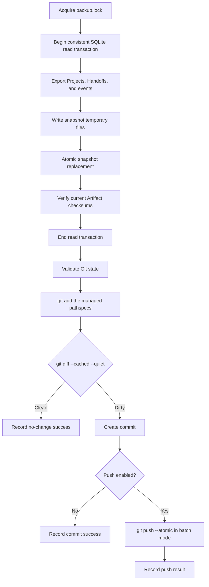

# Interfaces and Operations

This document owns the concrete surfaces of Sorage: filesystem layout, CLI syntax, error and exit codes, the local HTTP API, the Web information architecture, and the operational procedures for the daemon, Git backup, and restore.

It sits below [required-specification.md](required-specification.md), the accepted decisions in [architecture-decisions.md](architecture-decisions.md), and [domain-and-architecture.md](domain-and-architecture.md); where this document appears to disagree with any of them, they win.

Every surface is tagged with the milestone at which it must exist: `0.1` CLI core, `0.2` daemon with local HTTP API and Web UI, `0.3` Git backup, scheduling, and packaging.

## 1. Canonical product and runtime identity

| Item | Canonical value |
|---|---|
| Product | `Sorage` |
| Korean name | `소라게` |
| Repository | `irootkernel/sorage` |
| CLI executable | `sorage` |
| Default home directory | `~/.sorage/` |
| Home directory override | `SORAGE_HOME` |
| Configuration | `<home>/config.yaml` |
| Default Vault path | `~/.sorage/vault` |
| Vault marker | `.sorage-vault.json` |
| Default server bind | `127.0.0.1:46321` |
| macOS LaunchAgent label | `xyz.rootkernel.sorage` |
| Roadmap Epic ID format | `EPIC-NNN` |
| Roadmap Task ID format | `TASK-NNN` |

Every command MUST honor `SORAGE_HOME` as the home-directory override and MUST fall back to `~/.sorage` when the variable is unset (INIT-015); this is normative, not a testing convenience, and integration tests rely on it to run against a clean temporary home.

Every path in this document that begins with `~/.sorage/` means `$SORAGE_HOME/` when the variable is set.

Home layout:

```text
~/.sorage/
├── config.yaml
├── config.yaml.bak               # single last-known-good copy, replaced only after validation
├── vault/                        # default Vault, configurable
├── state/
│   ├── sorage.sqlite3            # plus -wal and -shm
│   ├── api-token                 # 0.2, mode 0600, at least 32 random bytes, base64url
│   └── backups/                  # database snapshots taken with VACUUM INTO
├── logs/
│   └── sorage.log                # plus rotated files
└── run/
    ├── daemon.json               # {pid, host, port, startedAt, version, installationId}
    ├── daemon.lock
    ├── config.lock
    ├── backup.lock
    ├── vault-move.lock
    └── migration.lock
```

Lockfiles are created with `O_EXCL` and contain `{pid, startedAt, hostname}`; `config.lock` is stale after 30 seconds or a dead pid, and `daemon.lock`, `backup.lock`, `vault-move.lock`, and `migration.lock` are stale only when the recorded pid is dead.

`migration.lock` guards the schema migration that every process runs at start, so a CLI invocation and a daemon start racing on a fresh upgrade cannot both migrate.

Nothing under `~/.sorage/state`, `~/.sorage/logs`, or `~/.sorage/run` is ever committed to Git.

## 2. Configuration ownership and normative defaults

`config.yaml` stores installation-wide settings only:

- Schema version and configuration revision
- Installation identity
- Vault path and import mode
- Loopback server settings
- Sender, Handoff, and Artifact policy
- Git backup policy
- Garbage-collection policy
- UI and logging preferences

It does not store:

- Project records
- Project directory bindings
- Handoffs, Artifacts, or Review Notes
- The API bearer token
- Git credentials
- Runtime pid, port, or lock state

Projects and bindings live in SQLite so that no operation has to write YAML and the database atomically (CFG-017).

Every configuration leaf except `installationId` declares a normative fixed default in [schemas/config.schema.json](schemas/config.schema.json); `installationId` is generated by `sorage init`, and `sorage config show --json` on a fresh installation returns that generated identifier together with exactly the declared defaults (CFG-020).

| Key | Type | Default | Notes |
|---|---|---|---|
| `schemaVersion` | integer, const `1` | `1` | Raised only by a schema migration |
| `configRevision` | integer ≥ 1 | `1` | Monotonic; incremented by every Sorage-mediated write (CFG-002) |
| `installationId` | UUID string | generated at `init` | The only leaf without a fixed default; it is created once and never rewritten |
| `vault.path` | string | `~/.sorage/vault` | Changed only through `sorage vault move --to <path>` (CFG-013, CFG-014) |
| `vault.importMode` | const `copy` | `copy` | The MVP imports by copy only (VLT-004) |
| `server.host` | enum `127.0.0.1`, `::1` | `127.0.0.1` | Loopback literals only; the name `localhost` is not accepted as a bind address (SEC-001) |
| `server.port` | integer 1024–65535 | `46321` | A change requires a controlled daemon restart (RUN-008) |
| `server.autoStart` | boolean | `false` | Milestone 0.2; no daemon exists in 0.1 |
| `server.openBrowserOnStart` | boolean | `false` | Milestone 0.2 |
| `handoff.allowUnregisteredSenders` | boolean | `true` | Unregistered Workspaces may send; they may never receive |
| `handoff.requireRegisteredRecipient` | const `true` | `true` | Fixed by PRJ-012 |
| `handoff.inboxMarker` | boolean | `false` | When true, every creation or state change rewrites `.sorage/INBOX.md` under each recipient binding directory (HND-026) |
| `artifact.maxBytes` | integer ≥ 1 | `104857600` | Enforced mid-stream during import, never after buffering (NFR-005) |
| `artifact.externalSourcePolicy` | enum `workspace_only`, `workspace_or_explicit` | `workspace_or_explicit` | Governs `SOURCE_OUTSIDE_WORKSPACE` and `--allow-external-source` |
| `artifact.verifyChecksumOnFetch` | boolean | `false` | Rationale below |
| `gitBackup.enabled` | boolean | `false` | Milestone 0.3; off in a 0.1 installation |
| `gitBackup.schedule.type` | const `daily` | `daily` | Milestone 0.3 |
| `gitBackup.schedule.at` | string `HH:MM` | `03:00` | Local time in `gitBackup.schedule.timezone` |
| `gitBackup.schedule.timezone` | IANA zone string | `UTC` | The DST rules of BKP-026 apply to this zone |
| `gitBackup.schedule.catchUpAfterMissedRun` | boolean | `true` | At most one catch-up run after a start (BKP-015) |
| `gitBackup.commit.messageTemplate` | string | `sorage backup: {timestamp}` | BKP-010 |
| `gitBackup.push.enabled` | boolean | `false` | Toggled by `backup enable-push` and `disable-push` (BKP-025) |
| `gitBackup.push.remote` | string | `origin` | Milestone 0.3 |
| `gitBackup.push.branch` | string | `main` | Milestone 0.3 |
| `gitBackup.largeArtifactWarningBytes` | integer ≥ 1 | `26214400` | Import warns above this size while backup is enabled |
| `gitBackup.snapshot.redactWorkspacePaths` | boolean | `true` | Redact `senderPathSnapshot`, binding paths, and path fields inside event `metadataJson` in the export |
| `ui.defaultPageSize` | integer 10–200 | `50` | Cursor page size |
| `ui.showArchivedByDefault` | boolean | `false` | Equivalent of `--include-archived` |
| `ui.timezone` | string or null | `null` | `null` means the system zone; timestamps are always stored in UTC (NFR-007) |
| `logging.level` | enum `debug`, `info`, `warn`, `error` | `warn` | Applies to every process; `warn` keeps a CLI invocation quiet (RUN-009) |
| `logging.includeFullPaths` | boolean | `false` | Path redaction is optional and stable IDs are always kept (SEC-011) |
| `logging.rotation.maxBytes` | integer ≥ 1 | `10485760` | Rotate `sorage.log` at this size |
| `logging.rotation.maxFiles` | integer ≥ 1 | `5` | Rotated files retained |
| `gc.graceHours` | integer ≥ 1 | `24` | Age before an unreferenced file under `artifacts/` may be swept |

`artifact.verifyChecksumOnFetch` defaults to `false` because a fetch is a read on the hot path and re-hashing a 100 MiB Artifact on every `sorage fetch` would make the common case slow for a failure mode that has three other detectors: `vault verify`, `backup verify`, and the mandatory verification inside `revise`, `accept`, backup, and restore (VLT-023).

Turning it on trades fetch latency for immediate detection, and an installation that stores small documents should consider it.

## 3. Initialization

`sorage init` creates the home directories, `config.yaml`, the installation identity, the operational database, and the Vault marker; from milestone 0.2 it also creates the API token at `~/.sorage/state/api-token` (INIT-003).

### 3.1 Non-interactive, milestone 0.1

```bash
sorage init \
  --vault "$HOME/.sorage/vault" \
  --non-interactive
```

| Flag | Milestone | Effect |
|---|---|---|
| `--vault <path>` | 0.1 | Sets `vault.path`; the default is `~/.sorage/vault` |
| `--non-interactive` | 0.1 | Never prompts; missing answers use documented defaults (INIT-005) |
| `--reconfigure` | 0.1 | Explicit repair or reconfiguration of an existing installation (INIT-006) |
| `--port <n>` | 0.2 | Sets `server.port` |
| `--start-daemon` | 0.2 | Starts the daemon after a successful init |
| `--initialize-git` | 0.3 | Initializes the Vault as a Git repository and writes `.gitattributes` (INIT-007, BKP-022) |
| `--enable-daily-backup` | 0.3 | Enables the daily schedule (INIT-008) |
| `--backup-at <HH:MM>` | 0.3 | Sets `gitBackup.schedule.at` |
| `--timezone <tz>` | 0.3 | Sets `gitBackup.schedule.timezone` |
| `--install-service` | 0.3 | Installs the `xyz.rootkernel.sorage` LaunchAgent (INIT-009) |

Passing a 0.2 or 0.3 flag to a build that does not implement it is a usage error, not a silent no-op.

### 3.2 Interactive wizard, milestone 0.3

```bash
sorage init
```

The wizard asks ten questions in order (INIT-004):

1. Vault path
2. Whether to create it
3. Server port
4. Whether to install the `xyz.rootkernel.sorage` macOS LaunchAgent
5. Whether to start the daemon
6. Whether to initialize the Vault as a Git repository
7. Whether to enable daily backup
8. Daily time and timezone
9. Whether to enable remote push
10. Whether to register a first Project (INIT-010)

The wizard prints a full summary and asks for one final confirmation before it mutates anything.

### 3.3 Idempotency

When a valid installation already exists:

- `init` reports the current status and exits 0.
- It does not overwrite `config.yaml`, the database, the Vault marker, or a Git repository.
- It suggests `sorage init --reconfigure` for a deliberate change.

When an invalid configuration exists (INIT-013):

- `init` stops and reports the validation errors.
- It suggests `sorage doctor` and explicit repair.
- It never deletes or replaces a user file.

## 4. Pre-initialization gate

Before initialization only these commands may run (INIT-011):

```text
sorage init
sorage help
sorage --help
sorage version
sorage completion
sorage doctor
```

Every other command returns `NOT_INITIALIZED` with the expected configuration path and `sorage init` as the suggested command (INIT-012).

Human form:

```text
ERROR [NOT_INITIALIZED]

Sorage has not been initialized.

Expected configuration:
  /Users/<user>/.sorage/config.yaml

Run:
  sorage init
```

JSON form:

```json
{
  "ok": false,
  "error": {
    "code": "NOT_INITIALIZED",
    "message": "Sorage has not been initialized.",
    "details": {
      "expectedConfigPath": "/Users/<user>/.sorage/config.yaml"
    },
    "recovery": {
      "suggestedCommand": "sorage init"
    }
  },
  "meta": {
    "requestId": "uuid"
  }
}
```

## 5. Configuration commands, authority, and reload

```bash
sorage config show
sorage config show --json
sorage config validate
sorage config set <key> <value> --as-user [--expected-revision <n>]
sorage config edit --as-user
```

Rules:

- `show` and `validate` are read-only, need no User context, and work while the daemon is unavailable.
- `set` and `edit` are User-admin operations and fail with `USER_CONTEXT_REQUIRED` without `--as-user`.
- `config edit` opens `$EDITOR`, captures the configuration revision and the ETag at the moment the editor opens, validates after the editor exits, and leaves the previous valid file active on failure (CFG-015).
- Both writes preserve existing comments and key order, verified by a round-trip diff over an annotated fixture (CFG-018).
- A successful write increments `configRevision` and appends `CONFIG_CHANGED`.
- A stale expected revision or a changed ETag returns `CONFIG_CONFLICT`.
- `server.host` accepts only `127.0.0.1` and `::1`.

### 5.1 Authority and concurrency

CFG-019 applies from milestone 0.1, with its daemon clause phrased conditionally: once the daemon exists, a running daemon is the only writer of `config.yaml` and the CLI routes writes through `PUT /api/v1/config` with `If-Match`.

When no daemon is running the CLI writes the file itself while holding `~/.sorage/run/config.lock`, following the ten-step atomic write of `domain-and-architecture.md` section 21.

The ETag is the SHA-256 of the canonical file bytes, not a function of `configRevision`, because a manual edit in an external editor changes the file without touching the counter; `--expected-revision <n>` compares the counter and the recomputed ETag comparison runs underneath it, so an out-of-band edit produces `CONFIG_CONFLICT` even when the counter still matches.

The daemon applies reloadable fields after its successful write; `POST /api/v1/runtime/reload` remains available for adopting an out-of-band manual edit, which is detected through the content-hash ETag.

### 5.2 Reload versus restart

| Field | Applies on |
|---|---|
| `schemaVersion` | Migration only; not user-editable |
| `configRevision` | Maintained by Sorage |
| `installationId` | Immutable after `init` |
| `vault.path` | `sorage vault move --to <path>` only (CFG-013) |
| `vault.importMode` | Fixed at `copy` |
| `server.host` | Daemon restart (RUN-008) |
| `server.port` | Daemon restart (RUN-008) |
| `server.autoStart` | Reload; affects the next start |
| `server.openBrowserOnStart` | Reload; affects the automatic browser opening of a daemon start (RUN-012) |
| `handoff.*` | Reload |
| `artifact.*` | Reload |
| `gitBackup.*` | Reload; the scheduler recomputes `nextDueAt` on its next tick |
| `ui.*` | Reload |
| `logging.*` | Reload |
| `gc.graceHours` | Reload |

`POST /api/v1/runtime/reload` re-reads and re-validates the file, applies every reloadable field, and returns the list of fields that still require a restart; `POST /api/v1/runtime/restart` performs the controlled restart.

## 6. Vault marker, layout, and verification

Marker `.sorage-vault.json`:

```json
{
  "type": "sorage-vault",
  "schemaVersion": 1,
  "installationId": "uuid",
  "createdAt": "UTC timestamp"
}
```

Managed layout:

```text
<Vault>/
├── .sorage-vault.json
├── .gitattributes
├── .gitignore                    # staging/
├── artifacts/
│   └── <handoff-id>/
│       └── <artifact-id>/
│           └── <stored-name>
├── snapshots/
│   ├── projects.json
│   ├── handoffs/
│   │   └── <first-2-hex-of-id>/
│   │       └── <handoff-id>.json
│   ├── events.jsonl
│   └── manifest.json
└── staging/
```

Vault initialization writes both `.gitattributes` and `.gitignore` in milestone 0.1, before any Git machinery exists, because the bytes they protect are written from the first import onward (VLT-024).

`.gitattributes` is written verbatim:

```text
artifacts/** -text -diff
snapshots/** text eol=lf
.sorage-vault.json text eol=lf
```

`.gitignore` contains the single line `staging/`.

Git initialization in milestone 0.3 re-asserts both files idempotently rather than assuming them, so a Vault created by an earlier build is backfilled the first time `sorage init --reconfigure` or Git initialization runs; until then `doctor` reports `vault.gitattributes` and `sorage backup verify` fails the check (BKP-022, which now owns only `core.autocrlf=false` and the verification).

Without `.gitattributes` a clone with `core.autocrlf=true` rewrites text Artifact bytes and breaks their recorded SHA-256, which is why the file is milestone 0.1 and not 0.3.

`storageKey` is the sole authority for an Artifact's location, and the `<artifact-id>` segment gives every Revision its own slot so a replacement never overwrites bytes in place (VLT-020).

`snapshots/handoffs/` is sharded by the first two hexadecimal characters of the Handoff UUID so a ten-thousand-Handoff Vault never places ten thousand files in one directory.

`snapshots/events.jsonl` carries the exported append-only event ledger so the audit trail survives a restore (BKP-023).

### 6.1 Marker adoption

A marker whose `installationId` differs from the current Installation blocks every mutation with `VAULT_INTEGRITY_ERROR`, and the only way to adopt it is the audited `sorage backup restore --from <vault-path> --as-user --confirm`, which emits `VAULT_ADOPTED` (VLT-019).

A marker whose `schemaVersion` is newer than the running build fails with `VAULT_SCHEMA_UNSUPPORTED`; Sorage never downgrades a Vault.

A non-empty directory without a valid marker is never silently adopted (VLT-003).

### 6.2 `sorage vault verify`

`vault verify` is the Git-independent integrity sweep and runs in milestone 0.1, before any backup machinery exists:

- The marker exists, parses, and its `installationId` matches the Installation.
- The marker `schemaVersion` is supported.
- Every live Handoff's current Artifact file exists at its `storageKey` and its recomputed SHA-256 matches (VLT-023).
- Every managed Artifact file is read-only where the filesystem supports it (VLT-008).
- No file under `artifacts/` is missing from the `artifacts` table beyond the `gc.graceHours` window, and no path referenced by a pending Intent is reported as an orphan.
- `staging/` holds no entry older than the grace window.

`vault verify` reports findings and exits non-zero on a blocking finding; it never repairs, rewrites, or deletes.

`sorage backup verify` is the superset that adds the Git checks of section 31 and exists only from milestone 0.3.

## 7. Vault relocation

Editing `vault.path` in YAML is not a relocation mechanism for a non-empty Vault (CFG-013).

```bash
sorage vault move --to "/new/vault/path" --as-user
```

The operation holds `~/.sorage/run/vault-move.lock` for its whole duration, and any other process that attempts a domain mutation while it is held fails with `SERVICE_PAUSED` and recovery guidance (RUN-014).

1. Validate the source marker.
2. Validate the target path and containment in both directions against Vault and Project bindings (VLT-017).
3. Acquire `vault-move.lock`.
4. Pause new mutations and the backup scheduler; other processes see `SERVICE_PAUSED`.
5. Copy managed content into the target's staging area.
6. Verify every current Artifact checksum against the copied bytes.
7. Create the target marker with the same `installationId`.
8. Activate the new path in the configuration atomically and append `VAULT_MOVED`.
9. Resume service and release the lock.
10. Retain the old Vault until the User explicitly confirms cleanup.

Any failure before step 8 leaves the original Vault active and the configuration untouched.

A Web screen for relocation is deferred; within the MVP relocation uses this command (WEB-016).

## 8. Project commands

```bash
sorage project add --name "Dolgorae" --slug dolgorae --dir "$HOME/projects/dolgorae"
sorage project list
sorage project show dolgorae
sorage project rename dolgorae --name "Dolgorae Writer"
sorage project bind dolgorae --dir "$HOME/projects/dolgorae-docs"
sorage project unbind dolgorae --dir "$HOME/projects/dolgorae-docs" [--confirm]
sorage project archive dolgorae --as-user
sorage project unarchive dolgorae --as-user
sorage project resolve [--path "/some/path"]
```

Path rules for every `--dir`:

- Expand `~`.
- Convert to an absolute path.
- Resolve symlinks.
- Require an existing directory when a binding is registered; `project unbind` additionally accepts the recorded directory of an existing binding after that directory has vanished, normalized against its longest existing ancestor.
- When the directory is inside a git working tree, store the git common directory and record `bindingKind = git_repository`; otherwise store the normalized real path with `bindingKind = directory` (PRJ-017).
- Reject a duplicate binding with `BINDING_DUPLICATE`, which also covers a directory that lies inside a repository already bound as `git_repository`, since binding a worktree or a subdirectory of a registered repository would create a second identity for the same repository; `UNIQUE(installationId, directory)` is the only uniqueness constraint (PRJ-016).
- Reject a slug that is already taken under case-insensitive comparison with `PROJECT_SLUG_CONFLICT` (PRJ-005); the comparison is Unicode-aware, an explicit `--slug` is stored case-folded exactly like a derived one, and the folding is locale-independent, so one name produces the same slug on every machine.
- Reject Vault and Project containment in either direction with `VAULT_CONTAINMENT` (VLT-017).
- Allow a nested binding and report it; resolution picks the deepest match (PRJ-008).

A second binding names a genuinely separate directory or repository that belongs to the same logical Project, such as a docs repository; a worktree of an already-bound repository is not one, because step 2 of section 9 already resolves it to the Project and binding it would fail with `BINDING_DUPLICATE`.

A Project may hold many bindings, and a Project with zero bindings is flagged as unbound by `project list` and by `doctor` and fails as a recipient with `PROJECT_UNBOUND` (PRJ-022).

`project unbind` that would leave a Project with open Handoffs unbound requires `--confirm` and otherwise fails with `CONFIRMATION_REQUIRED`; an **open Handoff** is one in `awaiting_recipient` or `changes_requested` that is not deleted (PRJ-022). A `--dir` whose directory no longer exists is accepted when it names the recorded binding directory, which the `bindings.exist` warning names, so a vanished binding can always be removed (PRJ-010).

An archived Project keeps `fetch`, `review set`, `review withdraw`, `accept`, and `decline` on the Handoffs already in its inbox and rejects new incoming Handoffs with `PROJECT_ARCHIVED` (PRJ-021).

A Project referenced by Handoffs is never physically deleted (PRJ-011); `archive` plus `unbind` is the complete retirement path.

## 9. Actor resolution and Unregistered Workspaces

Actor resolution is **provenance**, not authorization: it records where an operation came from so the event ledger and the next-actor derivation stay meaningful, and it does not isolate one AI session from another (CLI-017).

Resolution order for every actor-resolving command:

1. Normalize the working directory: expand `~`, make it absolute, resolve symlinks.
2. When the path is inside a git working tree, resolve `git rev-parse --path-format=absolute --git-common-dir` and normalize the result, so every worktree of one repository yields the same directory (PRJ-017).
3. Match against Project Bindings; `git_repository` bindings compare against the resolved common directory and `directory` bindings against the normalized path.
4. Select the longest matching prefix, which is the deepest binding when bindings nest (PRJ-007, PRJ-008).
5. When a `git_repository` binding and a `directory` binding both match, the `git_repository` binding wins, because a registered repository is a stronger statement of identity than a path that happens to contain it.
6. When two bindings of the same kind match at the same depth, which is reachable only through a bind mount or an APFS firmlink that `realpath` does not collapse, fail with `AMBIGUOUS_PROJECT` and name both Projects in the message.
7. Apply `--as <project-slug>` when supplied; it overrides the directory result, fails with `PROJECT_NOT_FOUND` for an unknown slug and with `PROJECT_UNBOUND` when the Project has no binding on this Installation (PRJ-018).
8. Apply `--as-user` when supplied; the actor becomes `user` and every resulting event records `actorKind = user` (CLI-019).
9. Otherwise derive an unregistered Workspace when `handoff.allowUnregisteredSenders` permits it.

`workspaceKey = SHA-256(installationId + "\n" + normalizedWorkspacePath)`, and `installationId` is preserved across restore so the key stays reproducible.

The **workspace root** of a binding is the stored directory for a `directory` binding, and the main working tree, that is the parent of the git common directory, for a `git_repository` binding.

The downgrade guard compares the normalized working directory against every binding's workspace root and fails with `SENDER_IDENTITY_DOWNGRADE` unless `--allow-unregistered` is supplied, in exactly two shapes (PRJ-019):

- The working directory is an ancestor of a workspace root, which is almost always a forgotten `cd` or a mistyped path rather than an intentional anonymous send.
- The working directory is contained in a workspace root but resolves to no Project, which is what a nested independent git repository inside a bound tree looks like: its own common directory matches no binding.

A working directory inside any worktree of a bound repository resolves to that Project and never downgrades, because step 2 folds every worktree onto the same common directory.

### 9.1 Unregistered Workspace rules

- Sending is allowed while `handoff.allowUnregisteredSenders` is true.
- Receiving is never allowed; a recipient MUST be an active registered Project with at least one binding (PRJ-012, PRJ-022).
- `senderKind` is `unregistered_workspace` and identity is the `workspaceKey`.
- The normalized path is stored as `senderPathSnapshot` for usability.
- `sorage outbox --current-workspace` lists exactly the Handoffs whose `senderWorkspaceKey` equals the key of the current directory.
- The Web UI shows Unregistered Workspaces on their own screen (WEB-010).

When a Workspace directory is later bound to a Project, that Project inherits sender authority over the Handoffs it already sent, while `senderKind` and `senderPathSnapshot` stay historically accurate (PRJ-015, PRJ-020).

### 9.2 User-admin context

`--as-user` is the only way to enter User-admin context, and these operations fail with `USER_CONTEXT_REQUIRED` when it is absent:

```text
review remove       pin              unpin
archive             unarchive        delete approve
delete reject       project archive  project unarchive
config set          config edit      vault move
backup enable       backup disable   backup enable-push
backup disable-push backup restore   token rotate
uninstall
```

Every other command accepts any resolved actor, including `project add`, `project bind`, `project unbind`, `project rename`, `project list`, `project show`, `project resolve`, `backup run`, `backup status`, `backup verify`, `daemon start|stop|restart|status`, `web`, `doctor`, `vault status`, `vault verify`, `config show`, and `config validate`.

> User-admin rows express workflow intent; any process that can read the API token or run the CLI as this OS user can assert User context (see `SEC-013` in [required-specification.md](required-specification.md)).

That sentence is printed in the `--as-user` help text and stands next to the permission matrix in [domain-and-architecture.md](domain-and-architecture.md), because a flag is a workflow marker and not an operating-system boundary (SEC-021).

`FORBIDDEN_ACTOR` is a guardrail against acting from the wrong directory, not a security boundary.

## 10. Artifact source policy

Default `artifact.externalSourcePolicy`:

```text
workspace_or_explicit
```

Behavior:

- A file inside the resolved sender workspace imports normally.
- A file outside it requires `--allow-external-source` on the CLI or an explicit confirmation in the Web upload flow, and otherwise fails with `SOURCE_OUTSIDE_WORKSPACE` (VLT-016).
- Under `workspace_only` the override does not exist and the import always fails.
- Sorage never grants new operating-system permissions; it can read only what the invoking user can already read.
- The source file is never moved, modified, or deleted (VLT-005).

## 11. Artifact import, MIME policy, and fetch

The MVP accepts exactly one regular file per Handoff and per revision (VLT-004, VLT-006).

1. Resolve and normalize the source path, and apply the source policy of section 10.
2. Reject directories, symlink loops, sockets, devices, and named pipes (SEC-007, VLT-015).
3. Stream the bytes into `<Vault>/staging/<uuid>` with a bounded buffer, computing SHA-256 during the copy (NFR-005).
4. Enforce `artifact.maxBytes` mid-stream and abort the moment the limit is crossed, with `ARTIFACT_TOO_LARGE`; the size is never learned by buffering the whole body first.
5. On any mid-stream abort, unlink the staging file immediately; whatever survives a crash is removed by the `staging/` sweep after the grace window.
6. `fsync` the staged file.
7. Commit the domain transaction with the Artifact row at `materialized = 0` and the `activate` Intent, then rename into `artifacts/<handoff-id>/<artifact-id>/<stored-name>` and `fsync` the parent directory (VLT-021, VLT-022).
8. Mark the file read-only where the filesystem supports it (VLT-008).
9. Record `originalName`, `storedName`, `mimeType`, `sizeBytes`, `sha256`, `importedFromPath`, and `storageKey` (VLT-007).

When Git backup is enabled and the source exceeds `gitBackup.largeArtifactWarningBytes`, the import succeeds and prints a warning naming the size, the threshold, and the fact that Git history keeps every committed revision of that file forever.

### 11.1 `send --body <text>`

`--body` materializes the supplied text as a Markdown Artifact so that every non-tombstone Handoff still has exactly one current Artifact (HND-023).

The staged file is named `<title-slug>-<revision>.md`, where `<title-slug>` is the sanitized Handoff title and `<revision>` is the current Revision number, so a later `revise` that supplies a body produces a distinct name; `originalName` and `storedName` are that name and `mimeType` is `text/markdown`.

`--file` and `--body` are mutually exclusive, and a body that is empty after trimming is a usage error.

### 11.2 MIME policy

- The recorded `mimeType` comes from an extension allowlist; Sorage never sniffs content to decide a type.
- `.md` records `text/markdown`, `.txt` records `text/plain; charset=utf-8`, and every other extension records `application/octet-stream`.
- The content endpoint serves `.md` and `.txt` as `text/plain; charset=utf-8` for preview, and everything else as `application/octet-stream` with `Content-Disposition: attachment` (API-010, WEB-006).
- Sorage never serves an Artifact inline as `text/html` or `image/svg+xml`, whatever its extension, because both execute script in the browsing context.
- Markdown preview is rendered by the SPA from the text response; the daemon never returns rendered HTML for Artifact content.
- Stored names are sanitized without changing the recorded original name (VLT-018).

### 11.3 Fetch is materialization

`sorage fetch <handoff-id>` returns the current Artifact metadata and a locally readable path (VLT-009, CLI-010).

In the MVP materialization does not copy: the returned path is the read-only in-Vault path derived from `storageKey`, and the caller is expected to read it, not to write it.

Only the first successful fetch by the recipient Project or the User records an event, `ARTIFACT_FETCHED_FIRST_TIME`, and sets `firstFetchedAt`; a sender fetching its own Handoff and all later fetches record nothing, and neither the timestamp nor the event increments Row Version or changes the review state (HND-012, HND-025).

Exactly two surfaces count as a fetch: `sorage fetch <id>` and `GET /api/v1/handoffs/{id}/artifact/content`, which is the endpoint that hands over the bytes.

`sorage get <id>` and the Web detail screen never count: they read metadata only, so they never set `firstFetchedAt` and never emit an event, and opening a Handoff in the Web UI therefore does not quietly disarm the sender's `withdraw`.

A fetch of a Handoff whose current Artifact is not yet materialized returns `ARTIFACT_MATERIALIZING`, and a fetch whose recomputed checksum fails while `artifact.verifyChecksumOnFetch` is enabled returns `ARTIFACT_CORRUPTED`.

## 12. CLI design principles

- Human-readable output is the default; `--json` emits the stable machine contract (CLI-001).
- In JSON mode standard output carries JSON only, and every diagnostic goes to standard error (CLI-002, CLI-003).
- Domain operations execute in the CLI process through the shared application layer, with no daemon required (RUN-003, CLI-018).
- Only `sorage web` and `sorage daemon *` talk to the daemon, so `DAEMON_UNAVAILABLE` is meaningful only there.
- The working directory supplies actor provenance unless `--as` or `--as-user` overrides it.
- Destructive User operations require `--confirm` or an interactive confirmation (CLI-014).
- Every error carries a stable symbolic code and, where one exists, recovery guidance (CLI-004, NFR-010).
- Help text names the next valid command after a common error (CLI-016).

## 13. CLI command catalog

### 13.1 Bootstrap

| Command | Milestone | Notes |
|---|---|---|
| `sorage init [flags]` | 0.1 | Section 3 |
| `sorage version` | 0.1 | Build version, the Bun version pinned in `.bun-version`, and the database schema version |
| `sorage help [command]` | 0.1 | Also `--help` on every command |
| `sorage completion <shell>` | 0.1 | CLI-015 |
| `sorage doctor [--json]` | 0.1 | Section 35 |
| `sorage uninstall --as-user --confirm` | 0.3 | Removes the LaunchAgent, `~/.sorage/state`, `run`, `logs`, and `config.yaml`; never deletes the Vault; prints the Vault path (INIT-016) |

### 13.2 Daemon and session

| Command | Milestone | Notes |
|---|---|---|
| `sorage daemon start` | 0.2 | Fails with `PORT_IN_USE` when the port is bound (RUN-013) |
| `sorage daemon stop` | 0.2 | Graceful drain before storage shutdown (SEC-015) |
| `sorage daemon restart` | 0.2 | Required after a `server.host` or `server.port` change (RUN-008) |
| `sorage daemon status` | 0.2 | Reads `run/daemon.json` and verifies `installationId` through `/api/v1/health` |
| `sorage web` | 0.2 | Starts the daemon when it is not running and opens the browser with a one-time secret (RUN-012, SEC-019) |
| `sorage token rotate --as-user` | 0.2 | Replaces the API token and invalidates every live browser session (SEC-020) |

### 13.3 Configuration and Vault

| Command | Milestone | Notes |
|---|---|---|
| `sorage config show [--json]` | 0.1 | Any actor |
| `sorage config validate` | 0.1 | Any actor |
| `sorage config set <key> <value> --as-user [--expected-revision <n>]` | 0.1 | Section 5 |
| `sorage config edit --as-user` | 0.1 | Captures the revision and ETag when the editor opens |
| `sorage vault status` | 0.1 | Path, marker, counts, sizes |
| `sorage vault verify` | 0.1 | Section 6.2 |
| `sorage vault move --to <path> --as-user` | 0.1 | Section 7 |

### 13.4 Project

| Command | Milestone | Notes |
|---|---|---|
| `sorage project add --name <name> [--slug <slug>] --dir <path>` | 0.1 | Registers a Project and its first binding (PRJ-003) |
| `sorage project list [--json]` | 0.1 | Flags unbound Projects |
| `sorage project show <project>` | 0.1 | Bindings, counts, lifecycle |
| `sorage project rename <project> --name <name>` | 0.1 | Slug is not renamed |
| `sorage project bind <project> --dir <path>` | 0.1 | Adds a binding (PRJ-016) |
| `sorage project unbind <project> --dir <path> [--confirm]` | 0.1 | `--confirm` required when it would leave open Handoffs unbound (PRJ-022) |
| `sorage project archive <project> --as-user` | 0.1 | Blocks new incoming Handoffs (PRJ-009) |
| `sorage project unarchive <project> --as-user` | 0.1 | Returns the Project to `active` |
| `sorage project resolve [--path <path>]` | 0.1 | Prints what the actor resolver would decide |

### 13.5 Handoff creation and discovery

| Command | Milestone | Notes |
|---|---|---|
| `sorage send --to <project> [--to <project> ...] --title <t> (--file <path> \| --body <text>) [--supersedes <id>] [--allow-external-source] [--allow-unregistered] [--idempotency-key <uuid>]` | 0.1 | One Handoff per recipient, one Dispatch Group, all-or-nothing (HND-006, HND-008) |
| `sorage inbox [--wait] [--timeout <s>] [--interval <s>]` | 0.1 | Section 13.9 |
| `sorage outbox [--current-workspace]` | 0.1 | Sender view for the resolved Project or Workspace |
| `sorage get <handoff-id>` | 0.1 | Metadata only; never sets `firstFetchedAt` and never emits an event |
| `sorage fetch <handoff-id>` | 0.1 | Section 11.3 |

The derived inbox marker (HND-026): when `handoff.inboxMarker` is `true`, every Handoff creation and every state change — including the recipient's first `fetch` and the User-admin retention decisions — rewrites `.sorage/INBOX.md` under each binding directory of the recipient Project. The marker is a rendered view of that recipient's current inbox, one line per non-archived, non-deleted Handoff as `- <handoff-id> <review-state> "<title>" revision <n>` under a header that states the file is derived, must never be edited, and is never read back as authority; corrupting or deleting it changes no command result, and the next state change recreates it. A marker that cannot be written — a read-only binding directory, for example — prints a warning on standard error and never fails the command, because the marker is advisory. Projects that enable the marker should ignore `.sorage/` in Git, which the shipped `use-sorage` skill instructs.

### 13.6 Review, revision, and terminal outcomes

| Command | Milestone | Notes |
|---|---|---|
| `sorage review set <id> (--text <text> \| --file <path>) [--target-revision <n>]` | 0.1 | Stale target Revision returns `REVISION_CONFLICT` (REV-005, REV-006) |
| `sorage review withdraw <id>` | 0.1 | Recipient withdraws the current Note whichever actor authored it; Revision unchanged (REV-016); the User uses `review remove --as-user` |
| `sorage review remove <id> --as-user --confirm` | 0.1 | Audited administrative removal (REV-015) |
| `sorage revise <id> --file <path> [--idempotency-key <uuid>]` | 0.1 | Identical content returns `NO_CONTENT_CHANGE` (HND-015) |
| `sorage revise <id> --no-change --reason <text>` | 0.1 | Valid only in `changes_requested`, else `NO_REVIEW_NOTE`; at most one consecutive, else `NO_CHANGE_LIMIT` (REV-017) |
| `sorage accept <id> --expected-revision <n> --expected-row-version <n>` | 0.1 | Both expected values are mandatory; an Artifact still at `materialized = 0` fails with `ARTIFACT_MATERIALIZING` (LIFE-002, CLI-013) |
| `sorage decline <id> --reason <text> --expected-row-version <n>` | 0.1 | Terminal `declined` with a mandatory reason (HND-022) |
| `sorage withdraw <id>` | 0.1 | Only from `awaiting_recipient` while both `firstFetchedAt` and `reviewEngagedAt` are null (HND-021) |

`withdraw` is available only while the recipient has neither read nor engaged: `firstFetchedAt` records the first fetch and `reviewEngagedAt` records the first `review set` and is never cleared, so withdrawing a Handoff whose Note was later withdrawn is still refused.

It refuses with `HANDOFF_ALREADY_FETCHED` when either timestamp is set, with `REVIEW_NOTE_PRESENT` from `changes_requested`, with `HANDOFF_TERMINAL` in a terminal state, and with `HANDOFF_DELETED` on a tombstone.

`revise`, `revise --no-change`, and `withdraw` are available to the sender or to the User acting as a proxy; the event records whichever actor ran the command.

### 13.7 Retention and deletion

| Command | Milestone | Notes |
|---|---|---|
| `sorage pin <id> --as-user` | 0.1 | Independent of review state (LIFE-007) |
| `sorage unpin <id> --as-user` | 0.1 | |
| `sorage archive <id> --as-user` | 0.1 | Terminal states only, else `HANDOFF_ARCHIVE_INVALID` (LIFE-008) |
| `sorage unarchive <id> --as-user` | 0.1 | Reverses archiving; a Handoff that is not archived fails with `HANDOFF_NOT_ARCHIVED` (LIFE-009) |
| `sorage delete request <id> [--reason <text>]` | 0.1 | Any participant, in any non-deleted state; a second pending request fails with `DELETION_ALREADY_REQUESTED` |
| `sorage delete approve <id> --as-user --confirm [--confirm-pinned <id>] [--idempotency-key <uuid>]` | 0.1 | Requires a terminal review state, else `HANDOFF_NOT_TERMINAL`; a pinned Handoff needs the distinct `--confirm-pinned <id>` argument, else `PINNED_DELETE_CONFIRMATION`; a missing or mismatched current Artifact fails with `ARTIFACT_CORRUPTED` without claiming deletion (LIFE-012, VLT-023) |
| `sorage delete reject <id> --as-user [--reason <text>]` | 0.1 | Records the decision (LIFE-016) |

### 13.8 Backup

| Command | Milestone | Notes |
|---|---|---|
| `sorage backup status` | 0.3 | Last attempt, success, commit, push, failure, repository size (BKP-016) |
| `sorage backup run [--idempotency-key <uuid>]` | 0.3 | Manual run under `backup.lock` |
| `sorage backup verify` | 0.3 | Section 31 |
| `sorage backup enable --daily-at <HH:MM> [--timezone <tz>] --as-user` | 0.3 | Writes `gitBackup.schedule` |
| `sorage backup disable --as-user` | 0.3 | |
| `sorage backup enable-push --remote <name> --branch <name> --as-user` | 0.3 | BKP-025 |
| `sorage backup disable-push --as-user` | 0.3 | |
| `sorage backup restore --from <vault-path> --dry-run --as-user` or `sorage backup restore --from <vault-path> --as-user --confirm` | 0.3 | Section 32 |

A Deletion Request may be filed from any non-deleted state, but approval requires a terminal review state, so every tombstone is terminal.

A tombstone rejects `fetch`, `revise`, `review set`, `review withdraw`, `review remove`, `accept`, `decline`, `withdraw`, and `delete request` with `HANDOFF_DELETED`, while `get`, listing with `--include-deleted`, `pin`, `unpin`, `archive`, and `unarchive` remain available.

### 13.9 Global options

| Option | Milestone | Meaning |
|---|---|---|
| `--json` | 0.1 | Machine output on stdout only |
| `--as <project-slug>` | 0.1 | Override working-directory resolution (CLI-020) |
| `--as-user` | 0.1 | Enter User-admin context (CLI-019) |
| `--confirm` | 0.1 | Explicit confirmation for a destructive operation |
| `--confirm-pinned <id>` | 0.1 | Distinct second confirmation for deleting a pinned Handoff |
| `--expected-row-version <n>` | 0.1 | Optimistic concurrency; see below |
| `--expected-revision <n>` | 0.1 | The exact Revision on `accept`; the configuration revision on `config set` |
| `--target-revision <n>` | 0.1 | The Revision a Review Note is written against |
| `--idempotency-key <uuid>` | 0.1 | Replay protection on `send`, `revise`, `delete approve`, and `backup run` (CLI-021, section 17.3) |
| `--limit <n>` | 0.1 | Page size; defaults to `ui.defaultPageSize` |
| `--cursor <token>` | 0.1 | Opaque cursor; section 19 |
| `--state <state>` | 0.1 | One of the five review states |
| `--sender <slug or workspace-key>` | 0.1 | Filter by sender identity |
| `--recipient <project>` | 0.1 | Filter by recipient Project |
| `--include-archived` | 0.1 | Include archived Handoffs |
| `--include-deleted` | 0.1 | Include tombstones |
| `--allow-external-source` | 0.1 | Accept a source outside the sender workspace |
| `--allow-unregistered` | 0.1 | Accept a deliberate unregistered send (PRJ-019) |
| `--supersedes <handoff-id>` | 0.1 | Link a new Handoff to the one it replaces; see below |
| `--wait [--timeout <s>] [--interval <s>]` | 0.1 | `inbox` only; see below |

`--expected-row-version` is mandatory only on `accept` and `decline`; it is accepted on every other mutating command and is enforced whenever it is supplied (HND-014). Commands that create a Handoff, or that mutate configuration or Projects, accept the flag for uniformity but carry no expectation, because there is no previously read Handoff row to compare against.

The value passed is the Row Version the client currently holds, never the value it expects afterwards, and reads, `fetch`, preview, and their events never move it (HND-025).

A `--supersedes` target MUST exist and MUST be in a terminal state, otherwise the send fails with `HANDOFF_NOT_FOUND` or `HANDOFF_NOT_TERMINAL` (HND-018).

The target need not share the recipient, a tombstone may be superseded because the link is metadata rather than content, and every Handoff of one fan-out may reference the same target.

`inbox --wait` in milestone 0.1 polls SQLite every `--interval` seconds, default `2`, until a new inbox item for the resolved actor appears or `--timeout` seconds, default `300`, elapse; on timeout it exits 0 with an empty list and `meta.timedOut: true` (CLI-020). The wait returns only the items that appeared after it began, so a Handoff the waiter already saw does not wake it even when it changes state, and the timeout result is the empty list rather than the items the waiter started from; because a wait lists only new items, `--wait` cannot combine with `--cursor`, and an `--interval` below one second is a usage error rather than an unthrottled poll.

## 14. CLI envelopes

Success:

```json
{
  "ok": true,
  "data": {},
  "meta": {
    "requestId": "uuid"
  }
}
```

Error:

```json
{
  "ok": false,
  "error": {
    "code": "SYMBOLIC_CODE",
    "message": "Human-readable message",
    "details": {},
    "recovery": {
      "suggestedCommand": "optional"
    }
  },
  "meta": {
    "requestId": "uuid"
  }
}
```

`meta.requestId` is the only universal meta field; `meta.timedOut` is added by `inbox --wait` and appears nowhere else.

The envelope is versioned and contract-tested through `make test-contract` (NFR-003, NFR-011).

## 15. Symbolic error codes

The mapping from symbolic code to HTTP status is published here and verified by `make test-contract` (API-011); a CLI-only code carries the status the daemon would use if the operation were reachable over HTTP.

| Code | HTTP status | Meaning | Recovery |
|---|---:|---|---|
| `NOT_INITIALIZED` | 503 | No valid installation at the resolved home | `sorage init` |
| `CONFIG_INVALID` | 422 | `config.yaml` fails schema validation | `sorage config validate`, then repair |
| `CONFIG_CONFLICT` | 409 | Stale configuration revision or changed ETag | Reload the configuration and retry |
| `DAEMON_UNAVAILABLE` | 503 | Daemon unreachable for a `web` or `daemon` command | `sorage daemon start` |
| `PROJECT_NOT_FOUND` | 404 | Unknown Project slug or id | `sorage project list` |
| `PROJECT_ARCHIVED` | 409 | Recipient Project is archived | `sorage project unarchive <project> --as-user` or choose another recipient |
| `PROJECT_UNBOUND` | 409 | Project has no binding on this Installation | `sorage project bind <project> --dir <path>` |
| `PROJECT_SLUG_CONFLICT` | 409 | The slug is already taken under case-insensitive comparison (PRJ-005) | Choose another slug, or `sorage project show <project>` to reuse the existing one |
| `BINDING_DUPLICATE` | 409 | The directory is already bound, or lies inside a repository that is already bound (PRJ-016, PRJ-017) | `sorage project resolve --path <path>` to see which Project already owns it |
| `UNREGISTERED_RECIPIENT` | 422 | Recipient is not a registered Project | `sorage project add` |
| `AMBIGUOUS_PROJECT` | 409 | Two bindings of the same kind match at the same depth; the message names both Projects | Pass `--as <project-slug>`, or remove the aliased binding |
| `SENDER_IDENTITY_DOWNGRADE` | 409 | An unregistered send from an ancestor of a binding workspace root, or from a nested independent repository inside one | Bind the directory, or pass `--allow-unregistered` |
| `VAULT_CONTAINMENT` | 422 | The Vault and a Project binding would contain one another (VLT-017) | Choose a directory outside the Vault, or move the Vault with `sorage vault move` |
| `HANDOFF_NOT_FOUND` | 404 | Unknown Handoff UUID, or one this actor does not participate in; a non-participant read never reveals that the Handoff exists | Verify the UUID with `sorage inbox` or `sorage outbox` |
| `FORBIDDEN_ACTOR` | 403 | The resolved actor may not perform this operation | Run from the correct directory, or use `--as` or `--as-user` |
| `USER_CONTEXT_REQUIRED` | 403 | A User-admin operation was invoked without `--as-user` | Re-run with `--as-user` |
| `CONFIRMATION_REQUIRED` | 422 | A state-conditional confirmation is missing, such as `project unbind` that would leave open Handoffs unbound | Re-run with `--confirm` |
| `HOST_NOT_ALLOWED` | 421 | The `Host` header is outside the allowlist; rejected before authentication and before routing | Reach the daemon as `127.0.0.1`, `localhost`, or `[::1]` on the configured port |
| `NOT_FOUND` | 404 | The request targets no endpoint in the section 18 catalog | Check the endpoint path against the API catalog of interfaces-and-operations.md |
| `METHOD_NOT_ALLOWED` | 405 | The endpoint exists but does not accept the request method | Use the documented method for this endpoint |
| `UNAUTHENTICATED` | 401 | No `Authorization` header was presented, or the one-time-secret exchange at `POST /api/v1/session` was refused | `sorage web` for a fresh browser session, or send the Installation API token |
| `TOKEN_INVALID` | 401 | A token was presented but is unknown, rotated, or expired | `sorage web` for a fresh browser session, or re-read the API token |
| `ROW_VERSION_CONFLICT` | 409 | The Handoff changed since the client last read it | Re-read the Handoff and retry with the new Row Version |
| `REVISION_CONFLICT` | 409 | The target or expected Revision is stale | Re-read the current Revision |
| `REVIEW_NOTE_PRESENT` | 409 | A Review Note exists on the Handoff | Resolve the Note: `sorage revise <handoff-id> --file <path>`, or `review withdraw` / `review remove` |
| `NO_REVIEW_NOTE` | 409 | `revise --no-change` was invoked outside `changes_requested`, where there is no Note to resolve | Use `revise --file <path>`, which is the only revision form outside `changes_requested` |
| `NO_CONTENT_CHANGE` | 422 | The supplied file has the current Artifact's SHA-256 | Change the document, or resolve the Note with `revise --no-change --reason` |
| `NO_CHANGE_LIMIT` | 409 | A second consecutive no-change resolution was attempted | The next resolution MUST change content |
| `HANDOFF_TERMINAL` | 409 | The Handoff is in a terminal review state | Create a superseding Handoff: `sorage send --supersedes <handoff-id>` |
| `HANDOFF_NOT_TERMINAL` | 409 | The operation requires a terminal review state, such as `delete approve`, or a `--supersedes` target that is not terminal | Reach a terminal state first with `accept`, `decline`, or `withdraw` |
| `HANDOFF_DELETED` | 409 | The Handoff is a tombstone; content operations are gone for good | Use `get` or a listing with `--include-deleted`, or create a new Handoff |
| `HANDOFF_ALREADY_FETCHED` | 409 | Withdraw is blocked because the recipient has fetched or reviewed: `firstFetchedAt` or `reviewEngagedAt` is set | Ask the recipient to decline, or supersede the Handoff |
| `HANDOFF_ARCHIVE_INVALID` | 409 | Archive was attempted outside a terminal state | Reach a terminal state first |
| `HANDOFF_NOT_ARCHIVED` | 409 | `unarchive` was attempted on a Handoff that is not archived | Nothing to do; `archivedAt` is already null |
| `DELETION_ALREADY_REQUESTED` | 409 | A pending Deletion Request already exists for this Handoff | Wait for the User decision, or `sorage delete reject <id> --as-user` first |
| `PINNED_DELETE_CONFIRMATION` | 422 | A pinned Handoff needs `--confirm-pinned <id>` | Re-run with the distinct confirmation argument |
| `IDEMPOTENCY_CONFLICT` | 409 | The same `Idempotency-Key` was reused with a different request hash | Use a new key, or replay the identical request |
| `CURSOR_INVALID` | 422 | The cursor does not match the supplied filter set | Restart the listing without `--cursor` |
| `ARTIFACT_TOO_LARGE` | 413 | The stream crossed `artifact.maxBytes` | Reduce the file, or raise the limit deliberately |
| `ARTIFACT_MATERIALIZING` | 409 | The current Artifact has not reached its `storageKey` yet | Retry; the next process start drains the intent |
| `ARTIFACT_CORRUPTED` | 409 | A recomputed SHA-256 does not match the recorded value | `sorage vault verify`, then restore from backup |
| `SOURCE_OUTSIDE_WORKSPACE` | 403 | The source file is outside the resolved sender workspace | Re-run with `--allow-external-source` |
| `VAULT_INTEGRITY_ERROR` | 409 | Marker mismatch, missing marker, or a failed integrity check | `sorage vault verify` |
| `VAULT_SCHEMA_UNSUPPORTED` | 409 | The Vault marker `schemaVersion` is newer than this build | Upgrade Sorage; Sorage never downgrades a Vault |
| `SERVICE_PAUSED` | 423 | `vault-move.lock` is held by a Vault move or, once restore exists, by `backup restore` | Wait for that operation to finish, then retry |
| `PORT_IN_USE` | 409 | The configured port is already bound | Stop the other listener, or change `server.port` and restart |
| `BACKUP_IN_PROGRESS` | 409 | A backup run already holds `backup.lock` | Wait for the running backup to finish, then retry |
| `GIT_BACKUP_CONFLICT` | 409 | Unsafe Git state or a non-fast-forward push | Resolve the repository state manually |
| `GIT_AUTH_REQUIRED` | 409 | Git or SSH credentials are missing in batch mode | Configure the credential helper or SSH key, then retry |
| `RESTORE_TARGET_NOT_EMPTY` | 409 | `backup restore` was run against a populated installation | Restore into a fresh installation |
| `INTERNAL_ERROR` | 500 | Unexpected failure | Inspect `meta.requestId` in `~/.sorage/logs/sorage.log` |

Event type names and error codes never share a token, so `HANDOFF_ACCEPTED` is only ever an event and `HANDOFF_TERMINAL` is only ever an error; the Project events are named `PROJECT_BINDING_ADDED`, `PROJECT_BINDING_REMOVED`, `PROJECT_STATUS_ARCHIVED`, and `PROJECT_STATUS_ACTIVE` precisely so that they cannot collide with the error codes `PROJECT_UNBOUND` and `PROJECT_ARCHIVED`.

## 16. Exit codes

| Exit | Meaning | Codes |
|---:|---|---|
| 0 | Success | none |
| 1 | Unexpected internal failure | `INTERNAL_ERROR` |
| 2 | CLI usage or parsing error | none; the parser rejects the invocation before a symbolic code exists |
| 64 | Invalid input | `AMBIGUOUS_PROJECT`, `VAULT_CONTAINMENT`, `CONFIRMATION_REQUIRED`, `PINNED_DELETE_CONFIRMATION`, `CURSOR_INVALID`, `NOT_FOUND`, `METHOD_NOT_ALLOWED` |
| 65 | Domain validation failure | `PROJECT_ARCHIVED`, `PROJECT_UNBOUND`, `PROJECT_SLUG_CONFLICT`, `BINDING_DUPLICATE`, `UNREGISTERED_RECIPIENT`, `SENDER_IDENTITY_DOWNGRADE`, `NO_REVIEW_NOTE`, `NO_CONTENT_CHANGE`, `NO_CHANGE_LIMIT`, `HANDOFF_TERMINAL`, `HANDOFF_NOT_TERMINAL`, `HANDOFF_DELETED`, `HANDOFF_ALREADY_FETCHED`, `HANDOFF_ARCHIVE_INVALID`, `HANDOFF_NOT_ARCHIVED`, `ARTIFACT_TOO_LARGE` |
| 66 | Entity not found | `PROJECT_NOT_FOUND`, `HANDOFF_NOT_FOUND` |
| 69 | Daemon unavailable | `DAEMON_UNAVAILABLE` |
| 73 | Filesystem or storage failure | `VAULT_INTEGRITY_ERROR`, `ARTIFACT_CORRUPTED` |
| 75 | Temporary conflict | `CONFIG_CONFLICT`, `ROW_VERSION_CONFLICT`, `REVISION_CONFLICT`, `REVIEW_NOTE_PRESENT`, `IDEMPOTENCY_CONFLICT`, `DELETION_ALREADY_REQUESTED`, `ARTIFACT_MATERIALIZING`, `SERVICE_PAUSED`, `PORT_IN_USE`, `GIT_BACKUP_CONFLICT`, `BACKUP_IN_PROGRESS`, `RESTORE_TARGET_NOT_EMPTY` |
| 77 | Permission or actor authorization failure | `FORBIDDEN_ACTOR`, `USER_CONTEXT_REQUIRED`, `HOST_NOT_ALLOWED`, `UNAUTHENTICATED`, `TOKEN_INVALID`, `SOURCE_OUTSIDE_WORKSPACE`, `GIT_AUTH_REQUIRED` |
| 78 | Not initialized or invalid configuration | `NOT_INITIALIZED`, `CONFIG_INVALID`, `VAULT_SCHEMA_UNSUPPORTED` |

The symbolic code is the primary machine contract; the exit code is the coarse category for shell callers, and `doctor` exits 0 whenever no check is `blocking`.

## 17. Transport, authentication, and daemon discovery

Everything in this section is milestone 0.2, because it exists only once the daemon does.

### 17.1 Authentication

- Every request carries `Authorization: Bearer <token>`, and the token is either the Installation API token read from `~/.sorage/state/api-token` by the CLI or a browser session token (SEC-002, SEC-003).
- The API token is at least 32 random bytes encoded base64url, stored `0600`, and compared in constant time; a request that presents no `Authorization` header at all is rejected with `UNAUTHENTICATED`, and a request that presents a token which is unknown, rotated, or expired is rejected with `TOKEN_INVALID` (SEC-020).
- Sorage uses no cookies anywhere, so there is no ambient credential to forge and no CSRF token mechanism (SEC-019).
- `sorage web` opens `http://127.0.0.1:<port>/#s=<one-time-secret>`; the SPA reads the fragment, immediately exchanges it at `POST /api/v1/session` for a session token held in `sessionStorage`, and clears the fragment from the address bar.
- The one-time secret is single-use and short-lived, and because it lives in the URL fragment it is never sent in a request line and never lands in a server log.
- A refused exchange at `POST /api/v1/session`, whether the secret is absent, already used, or expired, returns `UNAUTHENTICATED`.
- Direct navigation to `http://127.0.0.1:<port>/` without a session renders a static page that tells the User to run `sorage web`; it never issues a session by itself.
- `sorage token rotate --as-user` replaces the API token and invalidates every live session token.
- After a rotation the CLI retries once, and only for a read operation; a mutation that meets `TOKEN_INVALID` surfaces it without retrying, so a rotation can never cause a write to run twice.

### 17.2 Request handling order

1. Validate the `Host` header against the allowlist `{127.0.0.1:<port>, localhost:<port>, [::1]:<port>}` and reject anything else with `HOST_NOT_ALLOWED`, before authentication and before routing (SEC-017).
2. Authenticate the bearer token: no header at all is `UNAUTHENTICATED`, a presented but unusable token is `TOKEN_INVALID`.
3. Evaluate `Idempotency-Key` replay, before any Row Version or `If-Match` check (API-012).
4. Apply the Row Version or `If-Match` precondition.
5. Execute the application use case.

Every response carries `Content-Security-Policy`, `X-Content-Type-Options: nosniff`, and `Referrer-Policy: no-referrer` (SEC-018).

Host validation runs first on purpose: a DNS-rebinding page must be turned away before the daemon inspects any credential, so `HOST_NOT_ALLOWED` is returned even for a request that carries a perfectly valid token.

The allowlist deliberately keeps the name `localhost` for the browser's `Host` header while the `server.host` bind enum does not, because a bind name can resolve off-loopback and a `Host` header cannot change where the socket already listens.

### 17.3 Idempotency

`Idempotency-Key: <uuid>` is optional, is accepted on exactly six operations — create, fan-out, upload completion, revise, deletion approval, and a manual backup run — and when it is present the replay rules below MUST be honoured (API-005).

| Operation | CLI | Endpoint |
|---|---|---|
| Create | `sorage send --idempotency-key <uuid>` | `POST /api/v1/handoffs/import-path` |
| Fan-out | `sorage send --to ... --to ... --idempotency-key <uuid>` | `POST /api/v1/handoffs/import-path` |
| Upload completion | not applicable | `POST /api/v1/handoffs/upload` |
| Revise | `sorage revise --idempotency-key <uuid>` | `POST /api/v1/handoffs/{id}/revise` |
| Deletion approval | `sorage delete approve --idempotency-key <uuid>` | `POST /api/v1/handoffs/{id}/deletion-approve` |
| Manual backup run | `sorage backup run --idempotency-key <uuid>` | `POST /api/v1/backup/run` |

A record stores `key`, `scope`, `requestHash`, and the original response for 24 hours; the same key with the same request hash replays the stored response verbatim, and the same key with a different hash returns `IDEMPOTENCY_CONFLICT`.

Because replay is evaluated before the Row Version check, a retried create never fails with `ROW_VERSION_CONFLICT` merely because the first attempt already succeeded.

### 17.4 Daemon discovery

The daemon writes `~/.sorage/run/daemon.json` atomically at bind time with `{pid, host, port, startedAt, version, installationId}` and holds `daemon.lock` for its lifetime (RUN-013).

The CLI discovers a running daemon by reading that file and confirming `installationId` through `GET /api/v1/health`; a file whose pid is dead or whose `installationId` does not match is treated as stale and ignored.

Path-based imports are accepted only from the authenticated local CLI context, never from a browser request (API-004).

## 18. HTTP endpoint catalog

Every endpoint is milestone 0.2 unless it is marked 0.3, and every path is prefixed by the version segment `/api/v1` (API-001).

### 18.1 Runtime and session

```text
GET  /api/v1/health
GET  /api/v1/readiness
GET  /api/v1/version
GET  /api/v1/runtime/status
GET  /api/v1/diagnostics
POST /api/v1/runtime/reload
POST /api/v1/runtime/restart
POST /api/v1/session
POST /api/v1/token/rotate
```

`GET /api/v1/health` returns `installationId`, so a CLI that found a stale `daemon.json` can detect that the listener belongs to a different Installation; it also returns the daemon build `version`. `GET /api/v1/version` returns `{daemon, version}` and `GET /api/v1/readiness` returns `{ready}`, with `503` instead of `200` while the daemon reports not ready. Every success and failure body is the versioned protocol envelope, and a request whose path is absent from this catalog or whose method the endpoint does not accept is answered with `NOT_FOUND` at `404` or `METHOD_NOT_ALLOWED` at `405` with an `Allow` header, before any later milestone's authentication middleware could matter.

`GET /api/v1/diagnostics` returns the `doctor` check catalog of section 35 in the same JSON shape the CLI emits, which is what the Web Diagnostics screen renders; it is the API surface named by API-007.

`POST /api/v1/session` is the only endpoint that accepts the one-time fragment secret instead of a bearer token. The secret is posted as a JSON body of the shape `{"secret": "<one-time-secret>"}`, and a successful exchange returns `{token, tokenType: "session"}` for the SPA to hold in `sessionStorage`; the pending secret is a single record, so any exchange attempt — matching, wrong, or replayed — spends it, and a refused attempt leaves the holder running `sorage web` again. `POST /api/v1/token/rotate` performs the same replacement as `sorage token rotate --as-user` and accepts only the Installation API token, never a browser session.

The health, readiness, and version endpoints are the only unauthenticated endpoints: they answer before any credential exists in a discovery probe's context, expose no Handoff or Project data, and remain behind the Host allowlist and the security headers like every other response.

### 18.2 Configuration and Vault

```text
GET  /api/v1/config
PUT  /api/v1/config
POST /api/v1/config/validate
GET  /api/v1/vault/status
POST /api/v1/vault/verify
POST /api/v1/vault/move
```

`GET /api/v1/config` returns an `ETag` that is the SHA-256 of the canonical file bytes, and `PUT /api/v1/config` requires a matching `If-Match` (CFG-019).

`POST /api/v1/vault/move` exists for parity with the CLI; no MVP Web screen calls it, because Web relocation is deferred (WEB-016).

### 18.3 Projects

```text
GET    /api/v1/projects
POST   /api/v1/projects
GET    /api/v1/projects/{projectId}
PATCH  /api/v1/projects/{projectId}
POST   /api/v1/projects/{projectId}/archive
POST   /api/v1/projects/{projectId}/unarchive
POST   /api/v1/projects/{projectId}/bindings
DELETE /api/v1/projects/{projectId}/bindings/{bindingId}
POST   /api/v1/projects/resolve
```

Bindings are a collection because a Project may hold many of them (PRJ-016).

### 18.4 Handoffs and Artifacts

```text
GET  /api/v1/handoffs
POST /api/v1/handoffs/import-path
POST /api/v1/handoffs/upload
GET  /api/v1/handoffs/{handoffId}
GET  /api/v1/handoffs/{handoffId}/artifact
GET  /api/v1/handoffs/{handoffId}/artifact/content
POST /api/v1/handoffs/{handoffId}/artifact/reveal
```

`POST /api/v1/handoffs/upload` streams multipart with a bounded buffer and enforces `artifact.maxBytes` mid-stream (API-003, NFR-005).

`GET /api/v1/handoffs/{handoffId}/artifact/content` returns `Content-Length`, an `ETag` equal to the recorded SHA-256, `Accept-Ranges: bytes` with `Range` support for resumable download, the `Content-Type` decided by section 11.2, and `Content-Disposition: attachment; filename="<originalName>"` for everything that is not previewable text.

`GET /api/v1/handoffs` accepts the same filters as `inbox` and `outbox`, including `includeArchived` and `includeDeleted`.

### 18.5 Review, revision, and terminal outcomes

```text
PUT    /api/v1/handoffs/{handoffId}/review-note
DELETE /api/v1/handoffs/{handoffId}/review-note
POST   /api/v1/handoffs/{handoffId}/review-note/withdraw
POST   /api/v1/handoffs/{handoffId}/revise
POST   /api/v1/handoffs/{handoffId}/accept
POST   /api/v1/handoffs/{handoffId}/decline
POST   /api/v1/handoffs/{handoffId}/withdraw
```

`DELETE /api/v1/handoffs/{handoffId}/review-note` is the administrative removal and requires User context (REV-015); `POST /api/v1/handoffs/{handoffId}/review-note/withdraw` is the recipient withdrawing the current Note, whichever actor authored it (REV-016).

`POST /api/v1/handoffs/{handoffId}/revise` accepts three request shapes: a streaming multipart upload, a JSON body naming a local path for the CLI context, and the JSON body `{"noChange": true, "reason": "<text>"}` for the bounded no-change resolution (CLI-012, REV-017).

`POST /api/v1/handoffs/{handoffId}/revise` accepts `Idempotency-Key`, so an interrupted revise can be retried without risking a second Revision (section 17.3).

`accept` requires both the expected Revision and the expected Row Version in its body; `decline` requires a reason and the expected Row Version.

### 18.6 Retention and deletion

```text
POST /api/v1/handoffs/{handoffId}/pin
POST /api/v1/handoffs/{handoffId}/unpin
POST /api/v1/handoffs/{handoffId}/archive
POST /api/v1/handoffs/{handoffId}/unarchive
POST /api/v1/handoffs/{handoffId}/deletion-request
POST /api/v1/handoffs/{handoffId}/deletion-approve
POST /api/v1/handoffs/{handoffId}/deletion-reject
```

`POST /api/v1/handoffs/{handoffId}/unarchive` replaces the `/restore` path of the previous Source of Truth revision, so `restore` now names disaster recovery only.

### 18.7 Backup, milestone 0.3

```text
GET  /api/v1/backup/status
POST /api/v1/backup/run
POST /api/v1/backup/enable
POST /api/v1/backup/disable
POST /api/v1/backup/enable-push
POST /api/v1/backup/disable-push
POST /api/v1/backup/verify
```

Restore has no HTTP endpoint: `sorage backup restore` is a bootstrap command that requires the daemon to be stopped and an empty installation (BKP-021), so the Web backup page links to the CLI instructions instead of offering a restore action.

## 19. Pagination

Cursor pagination is required for every list surface (CLI-009, NFR-006).

Sort order:

```text
updatedAt DESC, id DESC
```

A cursor encodes the last `(updatedAt, id)` pair together with a hash of the filter set that produced it: state, sender, recipient, `includeArchived`, `includeDeleted`, and page size.

Reusing a cursor with a different filter set changes the hash and fails with `CURSOR_INVALID` rather than silently paging through an inconsistent result.

Cursors are opaque to clients and are not required to survive a Sorage upgrade.

## 20. Web information architecture

Milestone 0.2 delivers a read-only dashboard plus the User-admin actions and upload creation; the Backup screen arrives with milestone 0.3.

```text
Dashboard                          0.2
Handoffs                           0.2
  Inbox
  Outbox
  Changes Requested
  Accepted
  Declined
  Withdrawn
  Archived
  Deleted
  Deletion Requests
Projects                           0.2
  Bindings
Unregistered Workspaces            0.2
Backup                             0.3
Settings                           0.2
  General
  Vault
  Server
  Git Backup
  YAML (read-only)
Diagnostics                        0.2
```

Every list screen offers the same filters as the CLI, and the Deleted view is the Web equivalent of `--include-deleted` (WEB-003).

The Web UI never bypasses the local API and holds no domain rules of its own (API-008).

## 21. Dashboard

Summary cards (WEB-002):

- Awaiting Recipient
- Changes Requested
- Accepted
- Declined
- Withdrawn
- Pinned
- Archived
- Deleted
- Deletion Requested
- Recently Updated
- Backup Health, milestone 0.3, shown only once Git backup exists

Handoff table:

| Column | Description |
|---|---|
| Title | Handoff title |
| Sender | Project, Workspace, or User |
| Recipient | One Project |
| State | Review state |
| Revision | Current Revision |
| Next Actor | Recipient, sender, User, or none |
| Updated | Last mutation time, rendered in `ui.timezone` or the system zone |
| Pinned | Retention marker |
| Backup | Whether the Handoff was included in the last successful backup, 0.3 |

## 22. Handoff detail

Required content (WEB-004):

- Title and UUID
- Review state and next actor
- Revision and Row Version
- Created, updated, and `firstFetchedAt` timestamps, where a null `firstFetchedAt` reads as "never fetched" and explains why withdraw is still available
- Sender and recipient identities
- Dispatch Group and `supersedes` links
- Artifact metadata, `storageKey`, size, MIME type, and SHA-256
- Safe preview, download, and Finder reveal
- The current Review Note with its target Revision
- The metadata event timeline
- Pin, archive, and deletion state

A tombstone renders as a Handoff whose Artifact section is replaced by a deletion notice carrying `deletedAt`, the approving decision, and the warning of section 33; it never offers preview, download, or reveal.

The timeline must never imply that historical Artifact content is retrievable.

## 23. Web creation

The upload form is milestone 0.2 and includes (WEB-007):

- Sender: a registered Project or User upload
- One or more recipient Projects
- Title
- File upload, streamed as multipart
- Optional superseded Handoff

For several recipients the form states explicitly that independent Handoffs will be created, and after submission it displays every Handoff UUID together with the Dispatch Group UUID (WEB-008).

The MVP Web UI provides no embedded Artifact editor (WEB-017).

## 24. Web settings

Settings shows the canonical configuration path and provides (WEB-012, WEB-013, WEB-015):

- Typed fields for every leaf in the schema, with its normative default or generated-value rule shown next to it
- A read-only view of the canonical YAML file
- Schema validation before save
- ETag conflict detection with a clear "the file changed outside this page" message
- A diff of the pending change before save
- Restart-required indicators matching the table in section 5.2
- Git backup settings and status, 0.3

The Web UI provides no YAML editor; the YAML view is read-only precisely so that comment preservation and schema validity stay guaranteed by the typed path (WEB-014).

Vault relocation is not offered in the Web UI within the MVP (WEB-016).

## 25. Git backup purpose

Git protects the current Vault content and the current exported metadata; it is not the operational database and not native Handoff versioning.

| Mode | Protection |
|---|---|
| Disabled | No Sorage-managed backup |
| Local commits | Local recovery only, not disk-loss protection |
| Remote push | Off-machine recovery, subject to the remote and its credentials |

The Web UI states plainly when protection is local-only (BKP-018).

## 26. Backup content

Included, and exactly these pathspecs:

```text
.sorage-vault.json
.gitattributes
.gitignore
artifacts
snapshots
```

`snapshots` contains `projects.json`, the sharded `handoffs/<xx>/<handoff-id>.json` files, `events.jsonl`, and `manifest.json` (BKP-005, BKP-023).

Excluded, always:

```text
SQLite database, WAL, and SHM
API token
Git credentials
Runtime logs
Pid and lock files
Staging files
```

`gitBackup.snapshot.redactWorkspacePaths`, default `true`, controls local-path redaction in the export.

While it is on, `senderPathSnapshot`, every Project Binding path, and every path field inside an event's `metadataJson` are redacted, because bindings are machine-local and paths are the most personal thing in the ledger.

The exported ledger is the audit record minus those local paths, and `backup restore` rebuilds the ledger exactly as exported, so a restored Installation shows redacted paths and never invents them back.

## 27. Backup algorithm and snapshot determinism



Snapshot export is deterministic, so an unchanged Vault produces byte-identical files and therefore no commit (BKP-024):

- Object keys are sorted lexicographically at every level.
- JSON uses two-space indentation, LF line endings, and one trailing newline.
- `events.jsonl` is one compact JSON object per line, ordered by `createdAt` then `id`, LF-terminated.
- Timestamps are UTC in fixed precision, so the same instant always serializes to the same string.
- No file records an export timestamp, a hostname, a username, a process id, or a tool version.
- `manifest.json` carries only the snapshot format version and the derived counts of projects, handoffs, events, and artifacts; it records no wall-clock time, no hostname, and no run duration, so it is stable whenever the data is stable.

The change test is exactly:

```bash
git add -- .sorage-vault.json .gitattributes .gitignore artifacts snapshots
git diff --cached --quiet -- .sorage-vault.json .gitattributes .gitignore artifacts snapshots
```

A clean exit means nothing changed and the run records a no-change success without creating a commit (BKP-009).

## 28. Git safety

Sorage MUST NOT:

- Force push
- Rebase
- Merge
- Resolve conflicts
- Change remote URLs without an explicit User action
- Store credentials
- Delete remote branches
- Rewrite history
- Stage or commit any path outside the managed pathspecs of section 26

Backup fails safely, with `GIT_BACKUP_CONFLICT`, when the index holds unrelated staged work, a merge or rebase is in progress, the checked-out branch is not the configured branch, the repository is corrupt, or a managed path is conflicted (BKP-013).

## 29. Scheduling

```yaml
gitBackup:
  enabled: true
  schedule:
    type: daily
    at: "03:00"
    timezone: "Asia/Seoul"
    catchUpAfterMissedRun: true
```

The daemon is the only process that runs scheduled jobs (RUN-002), and the scheduler works on a 60-second tick (BKP-026):

- Each tick recomputes `nextDueAt` from the `backup_runs` table in `gitBackup.schedule.timezone`; `backup_runs` is the only scheduler authority and there is no separate state file.
- A tick whose current instant is at or past `nextDueAt` starts a run.
- A scheduled local time that does not exist on a DST transition day runs at the next valid instant.
- A scheduled local time that occurs twice runs at its first occurrence.
- After a start, at most one missed run is executed as catch-up when `catchUpAfterMissedRun` is true; repeated missed intervals never produce a burst (BKP-015).
- Every run, scheduled or manual, holds `~/.sorage/run/backup.lock`; a concurrent run returns `BACKUP_IN_PROGRESS` rather than queueing.

A 60-second tick is used instead of a single long timer because a laptop that sleeps through 03:00 wakes into a tick that simply observes that the run is overdue.

## 30. Push

Push is optional and is controlled by `sorage backup enable-push` and `sorage backup disable-push` and their matching endpoints (BKP-011, BKP-025).

Every Git invocation runs as an argument array, never as a constructed shell string (SEC-004), under a 60-second timeout, with this environment:

```text
GIT_TERMINAL_PROMPT=0
GIT_ASKPASS=/usr/bin/true
SSH_ASKPASS_REQUIRE=never
GIT_SSH_COMMAND="ssh -oBatchMode=yes -oStrictHostKeyChecking=accept-new"
```

The only permitted push is a normal fast-forward `git push --atomic` to the configured remote and branch.

A prompt-free failure caused by missing credentials returns `GIT_AUTH_REQUIRED`; a non-fast-forward returns `GIT_BACKUP_CONFLICT` and the User resolves it manually (BKP-014).

Snapshot, commit, and push outcomes are recorded separately in `backup_runs`, so a successful commit with a failed push is visible as exactly that.

## 31. Backup verification

`sorage backup verify` performs every check of `vault verify` and adds the Git-aware checks:

- `.gitattributes` exists and contains the three lines of section 6 verbatim (BKP-022)
- The Vault repository has `core.autocrlf=false`
- Every current Artifact checksum matches, comparing the recorded value against the bytes on disk
- The snapshot manifest is present and internally consistent
- Exactly one current snapshot and one current Artifact exist per live, materialized Handoff
- No active Artifact exists for a deleted Handoff
- A Handoff whose current Artifact is still at `materialized = 0` is skipped and reported as a warning; the run does not fail on it
- No runtime file is tracked: no database, WAL, SHM, token, log, pid, lock, or staging path appears in `git ls-files`
- The repository is on the configured branch, has no in-progress merge or rebase, and has no unrelated staged work

`backup verify` never rewrites history and never repairs; it reports.

`sorage backup status` reports the last attempt, the last success, the last commit, the last push, the last failure with its symbolic code, the computed `nextDueAt`, and the current repository size on disk, so a Vault whose history has grown past what the User expects is visible before it becomes a problem.

## 32. Restore

```bash
sorage backup restore --from "/path/to/restored-vault" --dry-run --as-user
sorage backup restore --from "/path/to/restored-vault" --as-user --confirm
```

Restore is a bootstrap command, not a merge (BKP-021):

- The daemon MUST be stopped, and the operation holds `vault-move.lock` for its duration, so any other process attempting a domain mutation sees `SERVICE_PAUSED` (RUN-014).
- The target installation MUST have an empty database; a populated one fails with `RESTORE_TARGET_NOT_EMPTY`.
- `--dry-run` performs every validation and every checksum verification and reports what would be created, without writing anything; `--confirm` is required for the writing form and is not required with `--dry-run`, because a dry run cannot destroy anything.
- The Installation adopts the `installationId` from the Vault marker, which is the audited exception of VLT-019 and emits `VAULT_ADOPTED`, followed by `RESTORE_COMPLETED` when the rebuild finishes.
- Adopting the identifier is what makes `workspaceKey` reproducible, so an unregistered sender's outbox still resolves after a restore.
- Projects, Handoffs, Review Notes, lifecycle state, and the event ledger are rebuilt from `snapshots/projects.json`, `snapshots/handoffs/`, and `snapshots/events.jsonl`, preserving UUIDs, Revision, and Row Version.
- Every Artifact checksum is verified against the recorded value before the rebuild is committed (SEC-014).
- Managed Artifact files are re-set to `0444`, because Git checks files out as `0644` and does not preserve the read-only bit.
- Only the API token is regenerated; nothing else about the Installation identity changes.
- Project directory bindings are machine-local and are never restored; the User re-binds each Project with `sorage project bind <project> --dir <path>`, and `doctor` reports every unbound Project until they do.

A restore whose Vault marker `schemaVersion` is newer than the running build stops with `VAULT_SCHEMA_UNSUPPORTED` before touching the target.

## 33. Deletion and Git history

Required warning, whose text is carried by LIFE-015 from milestone 0.1 and repeated in the backup messaging of BKP-019:

> Sorage deletion removes the current managed Artifact, but prior Git commits may retain earlier content. The MVP does not rewrite Git history.

Git history purge is not implemented in the MVP (BKP-020).

Sensitive documents should use a private remote, and deletion must never be presented as secure erasure.

The reverse property is just as important and is easy to miss: Sorage retains only the current Artifact, so a Revision that is created and then replaced between two backups is not preserved anywhere, not in Sorage and not in Git.

## 34. Daemon and service operations

### 34.1 Lifecycle, milestone 0.2

| Command | Behavior |
|---|---|
| `sorage daemon start` | Acquires `daemon.lock`, drains `pending_fs_ops`, binds `server.host:server.port`, writes `run/daemon.json` atomically, then begins serving |
| `sorage daemon stop` | Stops accepting new mutations, lets in-flight work finish, closes storage, removes `daemon.json`, releases `daemon.lock` |
| `sorage daemon restart` | `stop` followed by `start`; required after a `server.host` or `server.port` change |
| `sorage daemon status` | Reports pid, uptime, host, port, version, and whether `/api/v1/health` confirms the expected `installationId` |

A start whose configured port is already bound fails with `PORT_IN_USE` and names both the port and the pid holding it when the platform can report it (RUN-013).

A start that finds a `daemon.lock` whose pid is dead breaks the stale lock; a start that finds a live one exits with a conflict rather than binding a second listener.

Graceful shutdown refuses new mutations before storage shutdown so no transaction is cut in half (SEC-015).

### 34.2 LaunchAgent, milestone 0.3

The per-user LaunchAgent is labeled `xyz.rootkernel.sorage` (RUN-007, RUN-011).

```bash
launchctl bootstrap gui/$UID ~/Library/LaunchAgents/xyz.rootkernel.sorage.plist
launchctl bootout gui/$UID/xyz.rootkernel.sorage
```

The legacy `load` and `unload` verbs are not used, and every value written into the plist is XML-escaped, including paths containing `&`, `<`, `>`, or quotation marks.

The default Vault lives under `~/.sorage/vault` rather than `~/Documents` specifically so that a launchd-started daemon does not trigger a macOS privacy prompt that no one is present to answer.

The binary the LaunchAgent points at is produced by `make build`, which compiles to `dist/sorage`, and the distributable is produced by `make package`, which signs that binary and emits the Homebrew formula inputs (NFR-013, NFR-016).

### 34.3 Logging

All Sorage processes write structured JSON logs to `~/.sorage/logs/sorage.log` (RUN-009).

- The configured level applies to every process, and the default `warn` keeps a CLI invocation quiet.
- Rotation uses `logging.rotation.maxBytes` and keeps `logging.rotation.maxFiles` rotated files.
- Path redaction follows `logging.includeFullPaths`, and stable identifiers are retained either way (SEC-011).
- Bearer tokens, one-time secrets, and Git credentials are never logged, at any level (SEC-010).
- Every log line carries the `requestId` that the CLI and API envelopes return, which is the intended way to find the record behind an `INTERNAL_ERROR`.

### 34.4 Uninstall, milestone 0.3

```bash
sorage uninstall --as-user --confirm
```

`uninstall` removes the LaunchAgent, `~/.sorage/state`, `~/.sorage/run`, `~/.sorage/logs`, and `config.yaml`; it never deletes the Vault, and it prints the Vault path so the User knows exactly what remains (INIT-016).

## 35. Doctor check catalog

`sorage doctor` emits a stable check catalog; each entry has a canonical dotted `id`, a `severity` of `ok`, `warning`, or `blocking`, a `message`, and an optional `recovery`, and the catalog is part of the versioned CLI JSON contract (INIT-017).

This section is the only normative definition of the catalog; every other document points here rather than restating it.

The command exits 0 when no check is `blocking`, and it is usable before and after initialization (INIT-014).

| Check id | Milestone | Severity | Verifies | Recovery |
|---|---|---|---|---|
| `home.permissions` | 0.1 | blocking | The home directory resolved from `SORAGE_HOME` exists and `config.yaml` is owner-only | Recreate the home tree with `sorage init --reconfigure`, or restore owner-only permissions |
| `config.schema` | 0.1 | blocking | `config.yaml` parses and validates against the schema with declared defaults applied | `sorage config validate`, then repair the reported keys |
| `config.lock` | 0.1 | warning | No `config.lock` is held by a dead pid or older than its 30-second staleness window | Remove `~/.sorage/run/config.lock` once no `sorage` process is running |
| `vault.marker` | 0.1 | blocking | The marker exists, parses, matches `installationId`, and has a supported `schemaVersion` | `sorage vault verify`; adopt a foreign Vault only through `sorage backup restore --from <vault-path> --as-user --confirm` |
| `vault.gitattributes` | 0.1 | warning | `.gitattributes` and `.gitignore` match section 6 verbatim (VLT-024), and from 0.3 the Vault repository also has `core.autocrlf=false` (BKP-022) | `sorage init --reconfigure` backfills both files; set the git configuration in the Vault repository |
| `vault.writable` | 0.1 | blocking | The Vault root, `artifacts/`, and `staging/` are writable by this operating-system user | Fix the directory permissions, or remount the volume read-write |
| `db.integrity` | 0.1 | blocking | `PRAGMA integrity_check` reports no corruption and the database is in WAL mode with foreign keys enabled | Restore from `~/.sorage/state/backups/`, or `sorage backup restore` into a fresh installation |
| `db.pendingIntents` | 0.1 | warning | Reports only the intents the start-up drain could not resolve, which are integrity-failed; an intent the drain cleared is never reported | Inspect the `ARTIFACT_INTEGRITY_FAILED` events for the affected Handoffs and restore them from backup |
| `db.migrations` | 0.1 | blocking | `schema_migrations` is at the version this build expects and `migration.lock` is not held by a dead pid | Install the matching `sorage` build; remove a stale `~/.sorage/run/migration.lock` |
| `artifacts.checksums` | 0.1 | blocking | Every live Handoff's current Artifact exists at its `storageKey` and matches its recorded SHA-256 | `sorage vault verify`, then restore the affected Handoff from backup |
| `bindings.exist` | 0.1 | warning | Every active Project has at least one binding and every binding directory still exists | `sorage project bind <project> --dir <path> for an unbound Project, or sorage project unbind <project> --dir <the recorded directory this warning names> for a binding whose directory vanished` |
| `bindings.nested` | 0.1 | warning | Nested bindings are reported together with the Project each one resolves to | Pass `--as <project-slug>` wherever the deepest match is not the intended Project |
| `bindings.ambiguous` | 0.1 | warning | No two bindings of the same kind alias the same directory through a bind mount or an APFS firmlink, which `realpath` does not collapse, which is the only way a resolution can raise `AMBIGUOUS_PROJECT`; `--as <project-slug>` is the documented escape | `sorage project unbind` the aliased path, or always pass `--as <project-slug>` from it |
| `daemon.reachable` | 0.2 | warning | `run/daemon.json` is fresh and `/api/v1/health` returns the expected `installationId` | `sorage daemon start`, or delete a stale `run/daemon.json` |
| `daemon.port` | 0.2 | warning | The configured port is not already bound by another process | Change `server.port` and restart the daemon, or stop the other process |
| `token.permissions` | 0.2 | blocking | `~/.sorage/state/api-token` exists with mode `0600` and holds at least 32 random bytes | `sorage token rotate --as-user` |
| `service.installed` | 0.3 | warning | The LaunchAgent is bootstrapped in `gui/$UID` and points at the installed binary | `launchctl bootstrap gui/$UID ~/Library/LaunchAgents/xyz.rootkernel.sorage.plist` |
| `backup.schedule` | 0.3 | warning | Backup is enabled, `nextDueAt` is computable in the configured zone, the last run did not fail, and the last success is not older than the configured cadence | `sorage backup run`, then read `sorage backup status` |
| `git.state` | 0.3 | warning | The Vault repository is on the configured branch, has no in-progress merge or rebase, holds no unrelated staged work, and its remote configuration matches the push setting | Resolve the repository state manually; Sorage never rebases or merges |
| `platform.tcc` | 0.1 | warning | The Vault and every Project binding directory are readable without a macOS privacy prompt | Grant Full Disk Access to the invoking terminal, or keep the Vault under `~/.sorage` |

The catalog holds exactly these twenty ids, `severity` is the worst severity the check can report, and a passing check reports `ok`.

The catalog is milestone-scoped: a 0.1 build emits the 0.1 ids only, and each later id appears when its milestone is reached, so a check is never reported as `ok` by a build that cannot perform it.

Before initialization every installation-dependent check reports `blocking` with the message "Sorage is not initialized" and `sorage init` as its recovery, and only `config.schema` names the expected configuration file, so a fresh machine gets one path to read and not twenty.

Checksums are verified exhaustively here and by `sorage vault verify`; there is no per-process start-up sweep, because paying for one on every CLI invocation would make the common command slow. Once the daemon exists it also runs a periodic background sweep bounded to 64 MiB of Artifact bytes per garbage-collection tick (0.2), which has no configuration key.

JSON shape:

```json
{
  "ok": true,
  "data": {
    "checks": [
      {
        "id": "vault.marker",
        "severity": "ok",
        "message": "Vault marker matches this installation."
      },
      {
        "id": "bindings.exist",
        "severity": "warning",
        "message": "Project 'gul' has no directory binding on this installation.",
        "recovery": {
          "suggestedCommand": "sorage project bind gul --dir <path>"
        }
      }
    ]
  },
  "meta": {
    "requestId": "uuid"
  }
}
```

Adding a check is a contract change: the id is stable once released, and a check that is removed is reported as `ok` with an explanatory message for one minor version rather than disappearing from the catalog.

A worked end-to-end session using these surfaces is in [examples/cli-workflow.md](examples/cli-workflow.md), and the annotated configuration is in [examples/config.example.yaml](examples/config.example.yaml).
